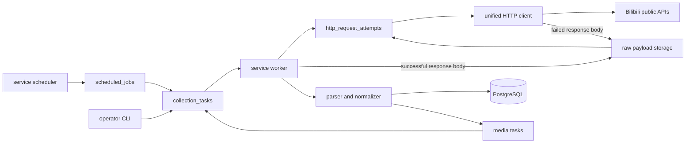
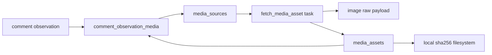

# Collection Pipeline

本文说明 Books of Time 当前实际实现的采集链路、状态语义、去重方式和证据边界。命令参数见 [CLI_REFERENCE](CLI_REFERENCE.md)，配置键见 [CONFIGURATION](CONFIGURATION.md)。

## 1. Canonical Runtime Path

正式采集路径是：



`service run` 同时或分别承载 scheduler、worker 角色。CLI 中的 `monitor-video`、`video comments` 和 `collect-latest-comments` 只负责入队；真正的网络请求由 worker 执行。

以下入口是诊断兼容路径，不是完整证据路径：

- `discovery loop`：直接扫描 YAML 静态 UID pool，不合并数据库 event UID target，也不保存 discovery raw/coverage。
- `discover-user`：直接扫描指定 MID 的单页投稿，不保存 user-list raw/coverage。
- `worker loop`：适合 smoke 和排空队列；正式常驻使用 `service run`。

需要可审计 discovery 时，使用配置 pool 或 event UID target，让 scheduler 生成 `discover_user_videos` task。

## 2. Persistent Task Lifecycle

任务保存在 `collection_tasks`，不是进程内临时队列。

```text
pending --lease--> running --success--> succeeded
   ^                 |
   |                 +--exception and retry remains--> pending with future not_before
   |                 +--retry exhausted-------------> failed
   +--expired running lease recovery-----------------+
```

当前状态值：

| 状态 | 含义 |
| --- | --- |
| `pending` | 等待 `not_before` 到达并由 worker 领取 |
| `running` | 已有 `lease_owner` 和 `lease_until` |
| `succeeded` | collector 已提交结构化结果和 coverage |
| `failed` | 重试耗尽、无 handler 或人工尚未重试 |
| `backoff` | schema/CLI 保留值；当前 worker 的失败重试实际写回 `pending + not_before` |

当前 task kind 与执行面：

| Kind | Worker handler | 公开入队方式 |
| --- | --- | --- |
| `fetch_video_stats` | 有 | monitor、event seed、discovery/snapshot scheduler |
| `fetch_hot_comments` | 有 | `video comments` |
| `fetch_latest_comments` | 有 | `collect-latest-comments` 和 follow-up |
| `fetch_comment_replies` | 有 | watchlist 自动派生 |
| `fetch_media_asset` | 有 | comment media 自动派生 |
| `discover_user_videos` | 有 | service scheduler |
| `analyze_similar_media` | 有 | 当前无公开 CLI/默认 job |
| `fetch_video_info` | 无，enum 保留 | 当前无公开入队方式 |

不要手工创建或重试 `fetch_video_info` task；worker 会以 `reason=no_collector` 标为 failed。视频 info 当前由 `fetch_video_stats` 同一次 response 解析。

领取顺序是 priority 降序，再按创建时间和 ID 升序。PostgreSQL 使用 `FOR UPDATE SKIP LOCKED`，因此多个 worker 可安全竞争任务；SQLite 只适合单进程开发。

### Lease And Recovery

- 默认 task lease 为 120 秒，来自 `scheduler.lease_seconds`。
- 每次 `run_once` 先恢复至多 100 个已过期 `running` task。
- 进程崩溃不会删除任务；lease 到期后会重新变为 `pending`。
- collector 完成时会清空 lease 并在同一事务中提交 task、coverage 和结构化结果。
- 服务收到 SIGINT/SIGTERM 后停止循环并等待当前 worker，最长等待 `service.shutdown_grace_seconds`。

### Retry And Backoff

任务默认 `max_retries=3`。一次失败会先将 `retry_count` 加一；只要 `retry_count <= max_retries`，任务仍会再次执行。因此默认最多可能出现首次尝试加 3 次重试。

- 普通 collector exception 使用 `scheduler.default_retry_delay_seconds`，默认 300 秒。
- timeout、network、403、429、captcha、5xx 和 parse error 使用持久化 `request_backoff_states`。
- 同 request type 连续失败采用指数倍增，并受全局最大退避 21600 秒约束。
- 任一 collector 成功后，当前实现会重置 `platform=bilibili, scope=global` 的全部 request backoff 计数。
- `task retry-failed` 会把匹配 task 重置为 `pending`、清零 retry count，不删除旧 raw 或 coverage。

### Idempotency

活动任务可设置 `idempotency_key`。同一 key 在 `pending`、`running` 或 `backoff` 状态只能有一条；任务结束后可创建下一条同 key 任务。常见 key 包括视频快照时间点、latest follow-up、watchlist root 和 media source ID。

幂等键防止重复排队，不等于删除重复观测。相同评论在不同时间再次出现时，系统会保留新的 observation，这是时间序列证据的一部分。

## 3. Unified HTTP, Cookies And Request Budget

所有正式 Bilibili API 和图片下载都经过统一 HTTP 层：

1. 每次请求读取当前账号凭据文件版本。
2. 有有效快照时注入最新 Cookie；没有或已确认失效时匿名请求。
3. 同时获取 `global`、`host:bilibili` 和具体 request type 三层 token。
4. token 获取完成后、网络 I/O 前写入 `http_request_attempts(status=started)`。
5. 执行带 timeout 的请求并记录实际开始、响应和结束时间。
6. 403、429、captcha、5xx 等带 body 的分类失败先保存 raw、关联 attempt，
   再向 collector/worker 抛出 `RequestFailure`。
7. timeout 和普通 network exception 写入 `failed` attempt，但不伪造 raw。
8. 成功 response 返回 collector；只有 collector 保存 raw 并在同一事务关联后，
   attempt 才从 `started` 变为 `succeeded`。

PostgreSQL 模式下 token 保存在 `request_budget_states`，多个 worker 共享预算。三层 token 在一个事务中原子保留，任一层不足都不会部分扣除其他层。连接同一数据库的实例必须使用完全一致的 `rate_limit` 规则。

Cookie 只改变请求认证上下文，不改变 task、raw、parser 和数据库生命周期。二维码登录、自动刷新和匿名降级见 [LOGIN](LOGIN.md)。attempt 只保存 method、request type、URL/规范化参数 SHA-256、状态和时间；Cookie、CSRF、refresh token、请求 headers、请求 body 和完整认证 URL 均不落 attempt 表。

attempt 状态严格为 `started`、`succeeded`、`failed`、`abandoned`。成功 HTTP
返回后若 collector 在 raw 持久化前失败，worker 会把仍为 `started` 的 attempt
标记为 `abandoned`；已经归档的失败 attempt 不会被覆盖。网络退避默认包含
`timeout=60s` 和 `network=60s`，其余分类沿用持久化 backoff 策略。
若失败 body 的 raw store 本身不可用，attempt 写为 `failed/raw_storage`、保留已知
HTTP 状态且不伪造 raw ID，原存储异常继续上抛。

当前 C1 实现使用 worker 的现有数据库 session，attempt、raw、coverage 和 task
终态在同一次最终 commit 中提交。它能保证正常异常路径的一致性，但进程在 commit
前崩溃仍可能整体回滚该次 attempt。C7 将把请求前 attempt 和请求后 raw/page 收口
迁移到独立短事务；在此之前不要把 C1 的 `started` 称为跨进程崩溃后必然持久的 WAL。

## 4. UID Discovery

`service run` 的自动发现只在
`10:00 <= Asia/Shanghai 本地时间 < 22:00` 生成任务。默认每 60 秒检查一次，
并保证正常运行的 scheduler 覆盖 `11:00`、`12:00`、`13:00`、`18:00`、
`19:00`、`19:30`、`20:00` 七个重点分钟。重点任务使用 priority 120，普通
窗口内任务使用 priority 110。每个重点时点生成两次检查：整分钟 T+0 和其后
30 秒 T+30。payload 的 `discovery_schedule_mode`、`focus_time`、
`focus_offset_seconds`、`scheduled_for` 和 `scheduler_slot` 可用于核对重点槽、
补检查和原始 scheduler 槽。窗口外 scheduler job 仍会推进自身持久化时钟，
但不生成平台请求任务。

同一 UID、同一重点槽的 T+0/T+30 使用跨全部 task 状态稳定的幂等键。即使
scheduler 在重点分钟内重复运行，已经成功或失败的同一重点对也不会再次创建。
如果 handler 晚到，T+0 立即可执行，T+30 的 `not_before` 仍至少晚 30 秒。

正式 discovery 每轮执行以下流程：

1. scheduler 合并 YAML 静态 UID pool 与当前生效的 event UID target。
2. 按 MID 只生成一个 task，但把 matrix/game/event 的全部来源去重、排序后写入
   `source_associations`；event/target 关联另写入 `event_links`。
3. 生成 `discover_user_videos` task，当前只请求投稿第 1 页。
4. worker 保存 `bilibili:user_video_list` raw 和 `raw_page_observations`，页面
   `extra` 保留完整来源列表。
5. parser 提取 BVID、投稿时间、来源 MID 和完整来源上下文。
6. 新 BVID upsert 到 `known_videos`，其中 `source_mid` 只保留首次来源兼容值，
   后续不得覆盖。
7. 每次发现都 upsert `known_video_sources`；同一 BVID 可关联多个 pool/game，
   并分别保留 first/last seen 与 first/last raw page。
8. 新视频只生成一条幂等 `fetch_video_stats` task，payload 带首次发现时的完整
   `source_associations`。
9. event UID target 发现的视频写入 `event_videos`，原因是 `uid_target`。

只有状态为 `active`、当前时间位于事件 start/end 窗口内、target 自身 active 的 UID target 才参与调度。

当前不会自动执行：

- 关键词平台搜索。
- `game` target 的平台搜索。
- 用户投稿第 2 页及更深历史翻页。
- 仅通过 diagnostic `discover-user` 自动建立 event 关联。

因此 UID discovery 是“在配置窗口内持续发现账号最新投稿”，不是账号全历史
导入。显式 `discovery loop` 属于 operator 诊断入口，仍允许在窗口外执行。

## 5. Video Snapshots

`fetch_video_stats` 使用视频信息响应同时写入：

- `video_metric_snapshots`：播放、点赞、投币、收藏、转发、评论、弹幕。
- `video_info_snapshots`：标题、简介、UP 主公开 MID/名称和 tags。
- `video_availability_snapshots`：visible 或平台不可用状态及 code/message。
- `raw_payloads`：原始 JSON 证据。
- `collection_coverage_stats`：本次任务摘要。

平台明确返回目标不可用时，collector 仍保存 raw 和 availability，但不写伪造的 metric/info，也不继续为该视频安排快照。

### Snapshot Cadence

`known_videos` 的详细快照使用当前代码内置策略：

| 投稿年龄/最近增长 | 间隔 |
| --- | --- |
| 小于 30 分钟 | 1 分钟 |
| 30 分钟到 6 小时 | 5 分钟 |
| 6 小时后，每小时播放增长大于 30000 | 5 分钟 |
| 6 小时后，每小时播放增长大于 6000 | 15 分钟 |
| 6 小时后，每小时播放增长大于 1200 | 30 分钟 |
| 其他 | 120 分钟 |

这里的代码阈值以“最近一小时总增长 / 60”计算每分钟增量，因此表中换算为每小时数值。

上述视频快照策略全天 24 小时生效，不读取新视频发现窗口。每天 22:00 后，
terminal job 还会为当日已发现且仍可用的视频生成一次幂等日终快照；它只是
额外检查点，不会停止后续常规指标 sweep。

### Persistent Cohort Planner And Shadow Mode

C3 已在 C2 状态/纯策略之上接入持久 planner，但仍没有改变当前请求所有权：

- `collection_policy_versions` 保存不可变 policy 内容；同一 kind/scope 只有一个 active 版本，回滚是重新激活旧版本。
- `video_collection_states.schedule_anchor_at` 首次采纳时复制 `known_videos.pubdate`，后续重复采纳不会用发现时间或服务重启时间重置。
- `snapshot_cohorts` / `snapshot_cohort_components` 保存计划时间点和组件状态；`collection_schedule_gaps` 保存未物化或未执行的时间范围。
- 原子物化在一个 caller-owned 事务中锁定单视频 state，创建唯一 cohort、缺失 component 和首任务；shadow 调用同一决策路径，但禁止创建 task。
- live 物化的 task、coverage 和 HTTP attempt 会直接携带 cohort/component ID；旧独立任务仍保持 NULL。
- UTC 对齐、上海活跃窗口、6/12/18/24 小时 checkpoint、S/A/B/C OR 评级、两次降级确认和 active/dormant/archived 规则已经是可测试纯函数。

配置模板仍是 `snapshot_cohorts.enabled: false`。设置为 `true` 且保持 `rollout_mode: shadow` 后，scheduler 每 30 秒评估 known videos：首次采纳固定 pubdate anchor，计算 tier/lifecycle，物化到期 routine/checkpoint，压缩 stale routine 为 gap，并把超过 60 分钟的历史 checkpoint 合并成一个当前 recovery 计划。所有父 cohort 使用 `shadow_planned`，`extra.shadow_target_status` 保存若 live 时应得到的状态。

首次发现晚于某 checkpoint 时，该 checkpoint 记录 `not_applicable_before_discovery`，不会伪造历史请求或进入 recovery。checkpoint 在 `scheduled_for + 60 minutes` 时仍可开始，晚一秒才转为 miss。已及时生成的 shadow checkpoint 不会因为 shadow 本来不执行而产生虚假 recovery。

当前 `video_snapshot_sweep`、daily terminal job 和 collector 递归调度仍是 live 视频指标 owner；外部 timer 仍负责周期 hot/latest 入队。C3 的 service 构建器拒绝 `rollout_mode: live`，所有权迁移在 C7 完成。因此 shadow 表中的计划不能被解释为评论已经自动抓取。

底层 live 执行语义已经固定供 C7 复用：worker 领取首任务时把 component/cohort 标为 running，并记录 task 生命周期的 `started_at`；`skew_seconds` 只在首个真实 HTTP attempt 落库时按 `request_started_at - scheduled_for` 写入，后续分页和重试不覆盖。没有发出 HTTP 的 task 保持 NULL skew。coverage 在同一事务中累计到 component，可重试失败保持 running，最终 success/partial/corrupted/failed 再聚合父 cohort。

## 6. Hot Comments

入队：

```bash
uv run python main.py video comments <BVID> --mode hot --tier c
```

流程：

1. 如果 task 尚无 AID，先请求视频信息解析 `data.aid`，并保存该 raw。
2. 从第 1 页开始请求 `page_limit` 页热门评论。
3. 每页保存 comment raw 和 `raw_page_observations`。
4. 写入 comment entity、append-only observation、状态事件和 watchlist。
5. 登记图片引用并生成 media task。

`--page-limit` 表示页数，不表示评论总数。每页实际条数由平台响应决定，不能用该参数要求服务端一次返回任意数量。`tier` 只在未显式传 `--page-limit` 时读取 `request_budget.<tier>.hot_pages`；collector 最少请求 1 页。

热门排序是动态结果。采集第 1 页和第 2 页之间，平台数据可能变化，导致边界项重复或跳动。系统的处理方式是：

- `comment_entities.rpid` 识别同一评论，不重复创建实体。
- 每次页面展示仍写新的 `comment_observations`，保留“当时看到了什么”。
- `raw_page_observations` 固定页码、时间、items 和 raw ID。
- coverage 记录请求/成功页数，但不会声称多页构成服务端事务快照。

热门换血分析只比较成功采集的第 1 页 Top N，避免把深页漂移解释为稳定排名。

## 7. Latest Comments Baseline And Frontier

最新评论使用平台 cursor，不使用固定页号作为唯一进度。单个 task 默认最多运行 55 秒，以便在一分钟调度尺度内及时提交进度；时间片结束会保存 cursor 并自动生成 follow-up。

### First Baseline: Tail Phase

首次运行从 head 向历史尾部扫描：

```text
no baseline
  -> baseline_paused       time budget reached; follow-up queued
  -> baseline_tail_complete server tail reached
  -> baseline_corrupted    retries exhausted or cursor loop
```

在第一张成功页面，系统记录 `baseline_start_frontier_rpid`，但此时它只是“baseline 开始时看到的头部锚点”，还不是正式增量 frontier。

### First Baseline: Head Sweep

tail 到达末尾后，下一次 latest task 从当前 head 回扫，直到重新遇到上述起点：

```text
baseline_tail_complete
  -> baseline_paused    head sweep exceeded time slice; follow-up queued
  -> baseline_complete  start anchor reached; official frontier established
  -> baseline_corrupted anchor never reached, retries exhausted, or cursor loop
```

这一步用于补采 tail scan 期间新出现的评论。tail 完成时不会自动立即派生 head-sweep task；需要再次运行 `collect-latest-comments`，或由外部任务规划再次入队。

### Incremental Scan

baseline complete 后，每次从 head 扫描：

- 遇到旧 `frontier_rpid`：`incremental_complete`，把本轮最前评论更新为新 frontier。
- 时间片耗尽：`paused`，保留 cursor 并自动 follow-up。
- 请求重试耗尽或 cursor loop：`corrupted`，不声称到达 frontier。
- 到达服务端末尾仍未见旧 frontier：`frontier_missing`，记录 `missing_after_seen` disappearance，并把本轮最前评论更新为 frontier。

### Retry And Corruption

同一 cursor 默认最多尝试 3 次，退避序列为 1、3、5 秒。重试状态保存在 `frontier_states.extra`，跨 follow-up 延续。尝试耗尽标为 corrupted；corrupted 不等于 complete，也不会自动从零重建 baseline。

### Consistency Boundary

cursor 分页也不是数据库快照。高频新增、折叠、删除或平台排序行为都可能改变后续页面。系统通过 rpid 实体去重、raw 页面留证、tail + head sweep 和 frontier outcome 降低歧义，但不能证明采集期间平台集合完全静止。

验收 baseline 时必须同时检查：

```bash
uv run python main.py coverage <BVID>
```

只有 `reason=baseline_complete` 且 `corrupted=false`、`truncated=false` 才可当作完成。`baseline_tail_complete` 只是中间状态。

## 8. Important Reply Watchlist

评论写入时只评估根评论。满足任一策略信号即可 upsert 到 `important_comment_watchlist`：

- 热门位置不大于 `watchlist.hot_max_position`。
- 相邻 observation 的回复增量达到 `reply_growth_min`。
- 相邻 observation 的点赞增量达到 `like_growth_min`。
- 文本命中显式配置的 controversy keyword。

首次发现可获得 `recent_first_seen_bonus`。候选会生成一条 `fetch_comment_replies` task，当前固定请求 1 页、每页最多 20 条。活动 task 使用 BVID + root rpid 幂等；watchlist 默认把 `expires_at` 延长到最后命中后的 1 天。

当前没有公开 CLI 用于列出或手动编辑 watchlist，也没有自动请求所有楼中楼深页。它是“重点 root 的一页证据采样”，不是全部回复树镜像。

## 9. Comment Identity, State And Visibility

### Entity Versus Observation

- `comment_entities`：一个 rpid 一行，保存首次看到的正文、公开作者和首次 raw。
- `comment_observations`：每次页面采集一行，保存当时正文、互动数、位置、visibility 和 media hash。

公开 `author_mid` 和 `author_name` 不做匿名化，便于核验。`first_content_hash` / `content_hash` 是规范化正文的 SHA-256 指纹，用于判断文本是否变化；它不会替代数据库中的可读正文。

评论同时区分三类 UTC 时间：

- `platform_created_at`：Bilibili reply 的 `ctime`，表示平台创建时间。
- `first_seen_at`：本系统第一次看到该 RPID 的时间。
- `captured_at`：这一条 observation 所属 response 的实际采集时间。

缺失或非法 `ctime` 不会用采集时间伪造，而是保持 NULL，并在 observation
`extra.platform_time_evidence` 中记录 `missing` 或 `invalid`。entity 保存首次已知
平台时间和公开作者证据；旧行后续重采时只补 NULL/缺失键，不覆盖首次正文、首次
作者名或已有 metadata。每条 observation 则完整保存当次快照。

结构化公开作者字段包括等级、官方认证 type/description、VIP status/type、是否
高级会员，以及版本化白名单中的 nameplate/pendant ID 与名称。签名、头像 URL、
IP location、Cookie 和其他 profile 字段不进入结构化作者列；完整 API response
仍可通过 raw 复核。本阶段不会为评论作者额外批量请求个人主页。

### State Events

系统会生成：

- `first_seen`
- `content_hash_changed`
- `like_bucket_changed`
- `reply_count_changed`
- `hot_position_changed`
- `media_changed`
- `media_added`
- `media_removed`
- `media_order_changed`

当前 media event 只在前后 observation 都已有非空、已登记的 media source 列表时比较。因此 `[A] -> [A,B]`、`[A,B] -> [A]` 和顺序变化会生成事件；无图 -> 有图、以及有图 -> 完全无图的边界目前可从 observation/link 差异复核，但不会生成对应 media_added/media_removed event。

点赞使用 `0-9`、`10-99`、`100-999`、`1k-9999`、`10k-99999`、`100k+` bucket，减少每次微小计数变化产生的事件噪声。

### Visibility Events

- `folded` / `unfolded`：只依据评论级 `folder.is_folded` 字段变化。
- `disappeared`：只有完整增量扫描到服务端尾部仍缺少曾见 frontier 时才写。
- `reappeared`：已有 disappeared 后又看到同一 rpid。

页面未采到某条评论、时间片耗尽或请求失败不会单独证明删除。visibility replay 也明确输出 `recorded_visibility_transition_not_platform_deletion_proof`。

## 10. Media Pipeline

评论 parser 从 `content.pictures` / `content.picture` 提取 `img_src`、`url` 或 `src`，保留图片顺序。



### Source Registration

- 原始 URL 明文保存在 `source_url`，同时保存 SHA-256。
- normalized URL 仅移除 query，保留 scheme、host 和 path。
- 原 URL hash 决定 `media_sources` 唯一性；normalized URL 只是下载候选，不证明图片相同。
- 一条 comment observation 可通过 `position=0,1,2...` 关联多图。
- 同一 source 的活动下载 task 按 source ID 幂等。

### Download And Exact Deduplication

media worker：

1. 获取三层 `bilibili:media_image` 请求预算。
2. 下载原始 bytes，并把响应另存为 raw payload。
3. 计算 `blob_sha256`。
4. 已有相同 blob 时复用 `media_assets`，不重复写 media 文件。
5. 新 blob 写入 `media_dir/sha256/ab/cd/<full_hash>.<ext>`。
6. 尝试解码并记录 MIME、扩展名、尺寸、大小、`pixel_sha256` 和 `phash`。
7. 回填 source 及所有 observation-media link 的 asset ID。

同一图片被不同评论或不同 URL 引用时，只要下载 bytes 完全一致，就共享一个 asset 和一个 media 文件。每次 HTTP 响应的 raw 仍可分别保留，因为请求时间和来源是独立证据。

### Hash Meaning

| 字段 | 输入 | 用途 |
| --- | --- | --- |
| `blob_sha256` | 原始下载 bytes | 强唯一去重和文件路径 |
| `pixel_sha256` | RGBA 模式、尺寸和解码像素 | 编码不同但像素一致的候选；不是唯一约束 |
| `phash` | 32x32 灰度 DCT 的 64 位感知 hash | 视觉相似候选 |
| `dhash` / `ahash` | 预留列 | 当前审计后停止计算，新 asset 写 NULL |

`media_ordered_hash` 对 source ID 顺序计算，`media_set_hash` 对去重排序后的 source ID 计算。它们检测评论图片列表变化，不是图片二进制 hash。

由于指纹基于 media source ID，同一 asset 若改用不同原始 URL，source-level 指纹仍会变化；需要判断二进制是否相同，应查询回填后的 `media_asset_id` / `blob_sha256`。

### Similarity Analysis Boundary

代码中存在 `analyze_similar_media` task handler：默认比较所有有 phash 的 asset，Hamming distance `<= 5` 时写 edge，再按连通分量创建 cluster。它不在采集链路中运行，当前也没有公开 CLI 或默认 scheduled job 自动入队。

该 v1 analyzer 是全量两两比较，适合小数据集离线验证；大库运行前需要候选索引/分批策略。相似 edge 是候选关系，不应与 `blob_sha256` 强去重混用。

media 始终保存在本地文件系统。`storage.backend=minio` 只影响 raw，不影响 media。

## 11. Raw Evidence

filesystem raw 路径：

```text
data/raw/YYYY/MM/DD/<run_id>/<payload_sha256>.<suffix>.zst
```

每条 `raw_payloads` 保存：request type、捕获时间、method、URL/params hash、HTTP status、payload SHA-256、URI、压缩前后尺寸和 parser version。URL hash 用于请求身份，不保存完整请求 URL。成功 response 由 collector 保存；已分类失败 response 由 HTTP evidence sink 在抛错前保存。

`http_request_attempts` 覆盖“发出过请求但没有 response body”的情况：

- `attempt_started_at` / `request_started_at` / `request_finished_at` /
  `response_received_at` 和 `duration_ms` 描述网络时间轴。
- `http_status`、`error_type`、截断后的 `error_message` 描述结果。
- 有 body 时 `raw_payload_id` 指向对应 raw；timeout/network failure 为 NULL。
- `collection_task_id` 把 attempt 归属到当前 worker task。

评论和 discovery 页面另有 `raw_page_observations`，把 raw response 解释为某个 target、页码/cursor、排序方式、parser version、状态和 item count。

证据链：

```text
report/analyzer result
  -> comment/video/event row
  -> raw_page_observation
  -> raw_payload <- http_request_attempt
  -> file:// or s3:// compressed object
```

`raw inspect` 会通过 storage router 读取 URI、解压并显示安全预览。迁移到 MinIO 后，router 可同时读取历史 `file://` 与新 `s3://`。

## 12. Coverage Semantics

每个 worker task 都写一条 `collection_coverage_stats`，包括：

- task/run/target 和开始结束时间。
- requested/succeeded pages。
- observed items 和保存的 raw 数。
- parse/request errors。
- frontier reached/missing。
- truncated/corrupted、reason 和 collector-specific extra。

coverage `status` 的生成规则：

| 状态 | 条件 |
| --- | --- |
| `succeeded` | collector 正常完成，且未 truncated/corrupted/frontier_missing |
| `partial` | time budget、frontier missing 或 `truncated=true` |
| `corrupted` | `corrupted=true` |
| `failed` | collector 抛异常、请求失败或没有 handler |

`pages_succeeded / pages_requested` 可计算页面成功率，但不是评论集合完整率。`items_observed` 是 observation 数，不是去重评论总数。

事件 coverage 只汇总 active event-video；有界查询使用 coverage 的 `finished_at` 落在 `[since, until)`。因此一个在窗口前开始、窗口内结束的 task 属于该窗口。

## 13. Current Automation Boundary

`service run` 当前自动执行：

- 仅在配置发现窗口内运行 UID discovery，并标记重点分钟。
- 全天运行已知视频指标 sweep。
- 每日 terminal 视频快照。
- Cookie refresh 检查。
- operational alert evaluation。
- 配置启用时，每 30 秒执行 snapshot cohort shadow planning，只写计划证据。
- 全天领取已入队的 hot/latest comment、latest follow-up、watchlist reply、
  media download、retry 和其他 collection task。

`snapshot_cohorts.enabled: false` 不注册 planner job，五张 cohort/policy 表可以存在且保持空；这不是运行故障。`enabled: true` 只增加 shadow job，不增加 collection task 或 HTTP 请求。`rollout_mode: live` 会在服务构建阶段被拒绝。

`service run` 当前不会自行周期入队：

- 每个视频的热门评论快照。
- 每个视频完成 tail 后的首次 latest head sweep。
- baseline complete 后的周期 latest 增量。
- media similarity analysis。
- 事件分析和报告。

这些能力已经可用，但仍需要 operator、外部定时器或后续 C4-C7 调度策略显式
入队/执行。评论 task 一旦入队便可在任意时间被 worker 领取；“全天运行”和
“shadow cohort 持续出现”都不等于当前服务会自行执行每个视频的 hot/latest 周期。
不要仅因 cohort 表持续增长就假设评论快照已经持续刷新。

## 14. Acceptance Checklist

单视频链路最小验收：

```bash
uv run python main.py monitor-video <BVID>
uv run python main.py video comments <BVID> --mode hot --page-limit 1
uv run python main.py collect-latest-comments <BVID> --max-scan-seconds 55
uv run python main.py worker loop --idle-sleep-seconds 0.2 --stop-when-idle
uv run python main.py video stats <BVID>
uv run python main.py coverage <BVID>
uv run python main.py task list --status failed --limit 100
```

验收时同时确认：

- 指标、热门评论和 latest 都有 raw/coverage。
- latest baseline 最终是 `baseline_complete`，不是 tail complete/partial/corrupted。
- 图片 task 成功后 source/link 已回填同一 asset。
- failed task 数为 0，或每条失败原因已解释。
- `service status` 没有未知 backlog、backoff 或 active alert。

真实数据完整示例见 [REAL_DATA_SMOKE](REAL_DATA_SMOKE.md)。
