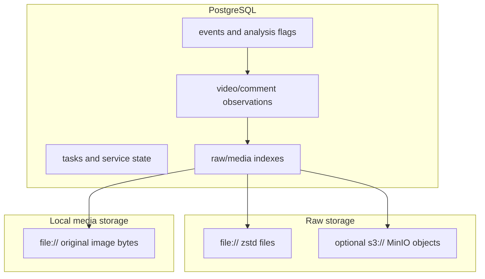
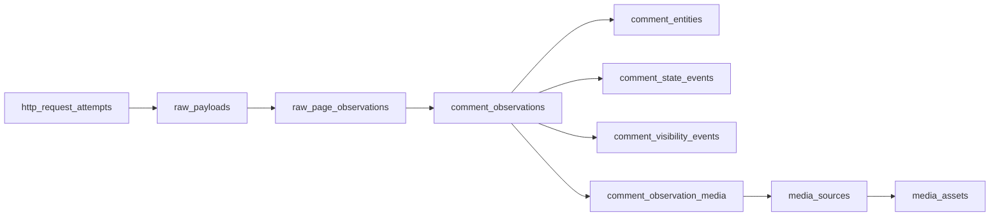

# Data Model And Evidence Relationships

Books of Time 使用 PostgreSQL 保存结构化事实和调度状态，使用 filesystem/MinIO 保存 raw payload，使用本地 filesystem 保存 media asset。三者共同构成可核验数据集。

本文对应当前 ORM 和 Alembic schema，不把历史设计稿中尚未落地的字段当作现状。

## 1. Storage Domains



- PostgreSQL 是查询、关系和运行状态事实源。
- raw payload 保存实际 HTTP response bytes 的 zstd 压缩副本。
- media 保存按 blob SHA-256 去重后的原始图片 bytes。
- accounts 不在 PostgreSQL：Cookie 快照位于本地加密文件，见 [LOGIN](LOGIN.md)。

仅恢复数据库而不恢复 raw/media，会留下不可读取的 `storage_uri`；仅恢复文件而不恢复数据库，会失去请求上下文和关系索引。

## 2. Time And Identity Conventions

### Time

应用层 datetime 必须 timezone-aware，写库时统一按 UTC 语义处理。CLI 分析窗口统一为半开区间：

```text
[since, until)
```

也就是包含 `since`，不包含 `until`。事件 coverage 按 task `finished_at` 归入窗口；评论、指标和状态事件按各自 capture/create 时间归入窗口。

评论使用三个不能互相替代的时间：

| 字段 | 来源 | 含义 |
| --- | --- | --- |
| `platform_created_at` | Bilibili `ctime` | 评论在平台上的创建时间；缺失/非法时为 NULL |
| `first_seen_at` | collector | 本系统第一次见到该 RPID 的时间 |
| `captured_at` | HTTP response/observation | 本次采集实际看到该状态的时间 |

不得用 `captured_at` 回填缺失的 `platform_created_at`。parser 会在 observation
`extra.platform_time_evidence` 记录 `parsed`、`missing` 或 `invalid`。

### Platform IDs

| ID | 含义 |
| --- | --- |
| BVID | Bilibili 视频公开标识 |
| AID/OID | 评论 API 使用的视频数字对象 ID |
| RPID | 评论公开数字 ID；当前 `comment_entities` 主键 |
| MID | 平台公开用户 ID |

公开 `author_mid`、`author_name`、`owner_mid` 和 `owner_name` 保留明文，用于回查和效果校验。分析结果必须限制在事件和时间窗内解释，不能把事件角色分数当成用户长期标签。

### Surrogate IDs

大多数高写入表使用 BIGINT 自增 ID。视频 metric/info/availability 使用 `(bvid, captured_at)` 复合主键，event-video 使用 `(event_id, bvid)`，media cluster member 使用 `(cluster_id, media_asset_id)`。

## 3. Evidence Chain

评论证据的常见链路：



视频证据链：

```text
raw_payloads
  -> video_metric_snapshots
  -> video_info_snapshots
  -> video_availability_snapshots
  -> event timeline/report evidence index
```

`raw_payload_id` 指 HTTP response 的 raw 索引；`raw_page_observation_id` 指 parser 对该 response 中某一页/目标的解释。一个 raw 页面可以关联多条 comment observation。

transport failure 没有 response body，因此 `http_request_attempts.raw_payload_id`
为 NULL；带 body 的分类失败会先建立 raw 并关联 attempt，再向 worker 抛错。

## 4. Foreign Keys And Logical References

当前 schema 对 event archive、`comment_analysis_flags`、media 核心关系、
`known_video_sources`、cohort policy/state，以及 `http_request_attempts` 的关键归属
建立数据库 foreign key。大量高写入证据字段，例如
`comment_observations.raw_payload_id`，仍是应用维护的逻辑引用，而不是 PostgreSQL
强制 foreign key。

这意味着：

- 不要手工删除 raw、comment、media 或 task 行并期待数据库阻止孤儿引用。
- 生命周期操作使用 CLI 的 active/inactive 状态，不删除历史证据。
- 清理和迁移前必须做引用审计、备份和抽样回读。
- 报告 evidence index 是可追踪索引，不是数据库约束证明。

事件相关的实际 FK 行为：

- 删除 `events` 会 cascade 到 targets、videos、keywords 和 analysis flags。
- 删除 event target 会把 event-video/event-keyword 的 `source_target_id` 置 NULL。
- 删除 comment entity 会 cascade 删除引用它的 analysis flags。
- 删除 known video 会 cascade 删除对应 `known_video_sources`；删除 raw page 只把
  source 的 first/last raw page 置 NULL。
- 删除 collection task 或 raw payload 会把 attempt 对应引用置 NULL，不删除
  `http_request_attempts` 本身。
- 删除 known video 会 cascade 删除对应 `video_collection_states`、cohort 和 gap；
  删除 cohort 会 cascade 删除 component。正常运维不应删除这些审计状态。
- `collection_tasks` / `collection_coverage_stats` 的 cohort/component ID 在 C2 是可空
  逻辑引用，没有 FK；C3 创建新任务时才开始填写，旧任务保持 NULL。

正常运维不应依赖这些 destructive cascade；事件停用/归档应使用状态字段。

## 5. Raw Evidence Tables

### `raw_payloads`

一条已归档 HTTP response 一行，包括成功 response 和带 body 的分类失败 response。
timeout/network failure 没有伪造 raw 行。

关键字段：

| 字段 | 含义 |
| --- | --- |
| `captured_at` | 响应捕获时间 |
| `request_type` | `bilibili:video_stats`、comment、media、discovery 等 |
| `method` | HTTP method |
| `url_hash` | 请求 URL 的 SHA-256，不保存完整 URL |
| `params_hash` | 规范化参数的 SHA-256，可为空 |
| `status_code` | HTTP 状态，可为空 |
| `payload_hash` | 未压缩 response bytes 的 SHA-256 |
| `storage_uri` | `file://...` 或 `s3://bucket/key` |
| `compressed_size` | zstd 对象大小 |
| `uncompressed_size` | 原始 response 大小 |
| `parser_version` | 当时使用或计划使用的 parser 版本 |

filesystem 文件名也包含 payload SHA-256，但相同 payload 在不同 run/date 目录下仍可各自保存，以保留请求时点。

### `raw_page_observations`

把 raw payload 解释为某个采集页面：

- `raw_payload_id`、`captured_at`、`request_type`
- `target_type` / `target_id`
- `page_number` 或 `cursor`
- `sort_mode`：hot/latest/reply/pubdate
- `parser_version`、`status`、`item_count`
- `extra`：next offset、is_end、folder 证据、discovery 来源等

它是 raw bytes 和结构化 observation 之间的页面级证据节点。

## 6. Comment Tables

### `comment_entities`

一个 RPID 一行，记录首次身份：

- BVID/OID、root/parent RPID。
- 公开作者 MID/名称。
- 首次已知 `platform_created_at`、等级、官方认证、VIP、高级会员和白名单 metadata。
- `first_content` 与 `first_content_hash`。
- `first_seen_at` 与 `first_raw_payload_id`。
- `created_at` / `updated_at`。

后续正文变化不会覆盖 `first_content`。重采只填充仍为 NULL 的平台/作者标量，
`author_public_metadata_extra` 只补不存在的顶层键；首次作者名和已有证据不覆盖。
`updated_at` 只表示实体再次被看到。

### `comment_observations`

每次页面看到评论就追加一行：

- rpid/bvid/oid/captured_at。
- raw payload/page 引用。
- sort mode、page number、position。
- 当时正文和 `content_hash`。
- `media_ordered_hash` / `media_set_hash`。
- like/reply count。
- 当时 `platform_created_at` 和公开作者字段。
- `visibility`、`is_deleted` 和 JSON `extra`。

该表是主要时间序列表。重复采到同一 rpid 会产生多条 observation，这是设计行为，不是重复数据错误。

`is_deleted` 当前默认 false；可见性变化主要由独立 event 表表达。

结构化公开作者字段为 `author_level`、official type/description、VIP status/type、
`author_is_senior_member`，以及版本化白名单中的 nameplate/pendant ID 与名称。
签名、头像 URL、IP location、Cookie 和其他 profile 字段保持 raw-only。公开 MID/
名称不匿名化，以便人工回查和效果校验。

### `comment_state_events`

连接前后 observation，保存：

- `previous_comment_observation_id` / `current_comment_observation_id`
- `event_type`
- `old_value` / `new_value` JSON
- `created_at`

事件类型包括 first seen、正文 hash、点赞 bucket、回复数、热门位置和 media 列表变化。

media 变化事件当前只覆盖前后都有非空 media 列表的比较；无图与有图之间的边界仍需直接比较 observation 及 `comment_observation_media`。

### `comment_visibility_events`

记录 folded、unfolded、disappeared、reappeared：

- 前后 observation ID 可为空。
- `old_visibility` / `new_visibility`。
- `missing_reason`，当前消失证据主要为 `missing_after_seen`。

disappeared 是采集证据状态，不等于平台删除事实。

### `important_comment_watchlist`

当前重点根评论状态：reason、priority、score、互动数、热门位置、最近 observation、first/last seen、expires、active 和策略 extra。`UNIQUE (bvid, rpid)` 防止同一视频 root 重复行。

watchlist 是可更新运行状态，不是 append-only 历史表；具体评论历史仍在 observations/events。

## 7. Media Tables

### `media_sources`

评论中看到的 URL 引用，一条原始 URL 一行：

- `UNIQUE (platform, source_url_hash)`。
- 原始/normalized URL 及各自 SHA-256。
- 当前 `media_asset_id`。
- pending/succeeded/failed 和错误详情。
- first/last seen、first/last raw page。

source URL 明文当前会保存，便于调试和核验。normalized URL 只去 query，不作为图片相同证据。

### `media_assets`

下载后按 bytes 去重的文件实体：

- `blob_sha256` 唯一。
- `pixel_sha256` 非唯一候选索引。
- MIME、扩展名、width、height、size。
- 本地 `storage_uri`。
- first seen/comment raw page/download raw payload。
- `phash`；`dhash` / `ahash` 当前保留为 NULL。

### `comment_observation_media`

observation 与 source/asset 的 n-n 关系：

- `UNIQUE (comment_observation_id, position)`。
- 冗余 bvid/rpid 便于查询。
- `position` 从 0 开始。
- `role` 当前主要为 `comment_image`。
- 下载成功后回填 `media_asset_id`。

### Similarity Tables

| 表 | 作用 |
| --- | --- |
| `media_similarity_edges` | 两 asset 的算法、版本、distance 和 confidence；稳定组合唯一 |
| `media_clusters` | 某次聚类结果及代表 asset |
| `media_cluster_members` | cluster 与 asset 的成员关系和代表距离 |

相似关系是离线候选，不参与强去重。当前没有公开 CLI 自动运行该分析。

## 8. Video Tables

### `known_videos`

discovery 见过的视频集合：BVID、首次来源 MID 兼容值、pubdate、first seen。它驱动自动视频快照 sweep；`source_mid` 创建后不因后续 pool 归属改变而覆盖。

手工 `monitor-video` 只入队指标任务；如果该 BVID 不在 `known_videos`，collector 能保存一次指标，但不会自动进入已知视频的长期 sweep。

### `known_video_sources`

视频与发现来源的多对多归属表，稳定身份是
`UNIQUE (bvid, source_mid, pool_type, pool_id)`：

- `game_id`、`official`、`monitored` 保存首次来源语义。
- `first_seen_at` / `last_seen_at` 保存时间范围。
- `first_raw_page_id` / `last_raw_page_id` 指向首次和最近 user-video-list 页面。
- 重复发现只更新 last seen/raw、`active` 和 `updated_at`，不改写首次 provenance
  或首次来源 metadata。

同一 MID 可同时属于 matrix、game 和 event pool；同一 BVID 因此可以有多行来源，
不能只读取 `known_videos.source_mid` 推断游戏归属。

### `video_metric_snapshots`

主键 `(bvid, captured_at)`，保存 view/like/coin/favorite/share/reply/danmaku 和 raw payload ID。

### `video_info_snapshots`

主键 `(bvid, captured_at)`，保存 title、description、公开 owner MID/name、JSON tags 和 raw ID。

### `video_availability_snapshots`

主键 `(bvid, captured_at)`，保存 status、Bilibili code/message、HTTP status 和 raw ID。scheduler 会跳过最近状态非 visible 的视频。

## 9. Collection And Request State

### `collection_policy_versions`

版本化、内容不可变的 cohort policy：

- `version` 全局唯一；scope 为 `global/global` 或 `game/<game_id>`。
- `policy`、timezone、algorithm、训练窗口、有效曝光量和排除原因保存生成依据。
- 同一 `(policy_kind, scope_type, scope_id)` 由跨 PostgreSQL/SQLite 的部分唯一索引保证最多一个 `active=true`。
- 激活新版本会给旧 active 写 `superseded_at`；回滚重新激活已有行，不复制或改写 policy JSON。
- repository 只 `flush`，调用方负责 commit/rollback。

### `video_collection_states`

每个已采纳 BVID 一行的可变策略状态：desired/effective tier、降级候选和连续次数、operator pin、life stage、next due、最近计划/完成/checkpoint、policy version 和 extra。

`schedule_anchor_at` 来自首次接受的 `known_videos.pubdate`，是发布年龄、对齐槽位和 checkpoint 的唯一时间轴。重复采纳不会修改 anchor、pin 或 `updated_at`。tier 严格为 `s/a/b/c`，life stage 严格为 `active/dormant/archived`。

### `snapshot_cohorts`

一个视频的一个计划时点一行，`cohort_key` 唯一。保存 immutable `scheduled_for`、reason、可空 age checkpoint、desired/effective tier、policy version、deadline、开始/完成时间、组件计数和 extra。

状态严格为：

```text
planned, shadow_planned, running, complete, partial, missed,
corrupted, blocked, not_applicable
```

`complete` 只表示所有适用 required component 满足各自 coverage 合同，不表示 Bilibili 评论集合在服务端被事务冻结。C2 尚不创建 cohort；C3 shadow planner 才开始写入。

### `snapshot_cohort_components`

`UNIQUE(cohort_id, component_kind)`。字段包含 required、状态、scheduled/deadline/start/finish、skew、计划/请求/成功页数、item/raw 计数、未来 scan run 逻辑 ID、failure reason 和 extra。

状态严格为：

```text
pending, running, complete, partial, joined_active_task,
missed_due_to_capacity, missed_due_to_service_gap, failed,
corrupted, not_applicable, blocked
```

聚合时 optional component 不影响完整性；required corrupted 优先，其次 active running/joined，再区分全 blocked、未开始的 miss、partial、complete 和全 not-applicable。

### `collection_schedule_gaps`

按 BVID 保存 `[gap_start, gap_end]` 范围、预期 cohort 数、原因、可空 service instance、policy version 和创建时间。时间范围必须正向，稳定组合唯一。它用于压缩表示离线/容量/策略前或发现前空档，避免重启后制造大量过期分钟级 task。

### `collection_tasks`

持久任务队列：kind、target、idempotency key、priority、budget cost、status、payload、not-before、lease、retry count/max retries、可空 `snapshot_cohort_id` / `snapshot_cohort_component_id` 和时间戳。

活动 idempotency key 使用 PostgreSQL/SQLite 条件唯一索引，只约束 pending/running/backoff。

### `collection_runs`

worker run 生命周期：run ID、worker ID、start/finish、status、started/succeeded/failed task 计数和 extra。一个长期 service worker 的多个 task 可归入同一 run ID。

### `collection_coverage_stats`

每个 task 的质量摘要：

- task/run/kind/target。
- start/finish/status。
- page、item、raw、parse/request error 计数。
- frontier reached/missing。
- truncated/corrupted/reason/extra。
- 可空 `snapshot_cohort_id` / `snapshot_cohort_component_id`，用于直接归属而不依赖 task payload JSON。

该表用于 `coverage`、event coverage、service status failure window 和 operational alerts。

### `frontier_states`

`UNIQUE (target_type, target_id, frontier_type)`。最新评论使用：

- `frontier_rpid` / `frontier_time`。
- 当前 cursor。
- last scan 状态、页数和 truncated。
- `extra` 中的 baseline status/start anchor/失败 cursor/attempts 等。

这是可恢复状态机，不是历史日志；每轮历史在 coverage/raw/page observations。

### `request_backoff_states`

`UNIQUE (platform, request_type, scope)`，保存最近错误种类、状态码、retry-after、连续失败次数、首次/最近失败和 backoff-until。成功请求会重置计数和截止时间，历史错误文本仍可能保留。

### `http_request_attempts`

每次正式 worker HTTP 尝试一行，状态严格为 `started`、`succeeded`、`failed`、
`abandoned`：

| 字段 | 含义 |
| --- | --- |
| `collection_task_id` | 当前 collection task；task 删除时置 NULL |
| `attempt_started_at` | evidence row 开始时间 |
| `request_started_at` / `request_finished_at` | 实际网络时间边界 |
| `response_received_at` | 收到 response 的时间；transport failure 为 NULL |
| `duration_ms` | request start 到 finish，不含队列和限流等待 |
| `method` / `request_type` | 安全请求分类 |
| `url_hash` / `params_hash` | SHA-256；不保存明文 URL/参数 |
| `http_status` | 有 response 时的 HTTP status |
| `error_type` / `error_message` | 分类和最多 2000 字符的安全错误摘要 |
| `raw_payload_id` | 有 body 且归档成功时的 raw；transport failure 为 NULL |

成功 response 在 collector 写 raw 前保持 `started`。分类失败 response 先保存 raw
再标 `failed`；timeout/network exception 直接标 `failed` 且无 raw；collector 在
raw 前中止则标 `abandoned`。Cookie、CSRF、refresh token、请求 headers、请求 body
和完整认证 URL 不进入此表。

失败 response 已收到但 raw store 写入失败时，attempt 为 `failed`、
`error_type=raw_storage`、`raw_payload_id=NULL`；已知 HTTP status 和时间仍保留，
存储异常继续向上层传播。

C1 当前与 collector 共用一个数据库 session，最终 commit 前的进程崩溃仍可能回滚
整次 attempt。C7 计划把请求前/后的证据写入独立短事务；当前文档不把它描述成
跨崩溃必然持久的 write-ahead log。

### `request_budget_states`

PostgreSQL 分布式 token bucket：`budget_key`、当前 token、refill rate、burst、last refill 和时间戳。规则漂移会被拒绝，不应手工修改 token 来扩大请求预算。

## 10. Service State

### `service_instances`

每个启动实例一行：instance ID、hostname、PID、版本、roles、starting/running/stopping/stopped/failed、start/heartbeat/stop 和最后错误。

历史实例不会自动删除；`service status --limit` 只显示最近一批。

### `scheduled_jobs`

持久周期 job：稳定 job key、kind、周期、priority、payload、enabled、next run、lease、最近成功/失败、连续失败和错误。

当前 kind：UID discovery、video snapshot sweep、daily terminal snapshot、account cookie refresh、operational alert evaluation。

### `operational_alert_states`

按 `alert_key` 去重的告警状态：type、severity、active/resolved、summary/details、首次/最近触发、评估/通知/恢复时间和次数。告警恢复时保留历史行。

## 11. Event Archive And Analysis

### `events`

事件稳定 slug、名称、游戏、描述、planned/active/closed/archived、start/end 和展示 timezone。slug 唯一且创建后不可修改。

### `event_targets`

事件研究范围：UID、keyword、seed BVID 或 game。稳定唯一键是 `(event_id, target_type, normalized_value)`；保存 priority、active、first/last seen 和 extra role。

### `event_videos`

主键 `(event_id, bvid)`，保存 source target、association reason/confidence、active 和 first/last seen。停用只改变分析范围，不删除采集证据。

### `event_keywords`

事件关键词按 normalized keyword + version 唯一。保存原文、category、active 和来源 target。当前 CLI 创建 keyword target 时同步 version 1。

### `comment_analysis_flags`

持久分析候选：

- 全局唯一 `stable_key`。
- event、flag type、subject/related rpid。
- confidence、algorithm、algorithm version。
- JSON evidence、detected/created time。

当前 flag 包括同 raw page 重复展示、同用户同文本投稿、跨视频模板相似。stable key 用于同算法版本幂等，不代表算法判断为事实。

## 12. Hashes Explained

所有 SHA-256 在数据库中以 32-byte `BYTEA` 保存，CLI/JSON 通常显示 64 字符十六进制。

| Hash | 计算对象 | 是否唯一约束 | 目的 |
| --- | --- | --- | --- |
| raw/attempt `url_hash` | 请求 URL 字符串 | 否 | 不保存完整 URL 时识别请求 |
| raw/attempt `params_hash` | 排序后的请求参数 JSON | 否 | 参数指纹 |
| raw `payload_hash` | 未压缩响应 bytes | 否 | 完整性校验 |
| `first_content_hash` | 首见正文 trim 后 UTF-8 | 否 | 首见文本指纹 |
| observation `content_hash` | 当次正文 trim 后 UTF-8 | 否 | 检测正文变化 |
| `source_url_hash` | 原图片 URL | source 组合唯一 | URL source 去重 |
| `normalized_url_hash` | 去 query 后图片 URL | 否 | 下载候选归并线索 |
| `blob_sha256` | 图片下载 bytes | 是 | 强文件去重和路径 |
| `pixel_sha256` | RGBA mode/尺寸/像素 | 否 | 像素一致候选 |
| media ordered/set hash | media source ID 列表 | 否 | 图片列表状态变化 |
| analysis `stable_key` | event/flag/评论/算法身份 JSON | 是 | flag 幂等 |

Hash 是内容指纹，不是加密，也不是匿名化。正文和公开作者仍保留；仅凭 hash 无法解释内容含义，但可以验证两次输入是否完全一致。

media 列表 hash 使用 source ID，不使用 asset ID。因此 URL source 改变但最终 blob 相同，列表 hash 仍可能不同。

## 13. Append-Only And Mutable Data

主要 append-only 事实：

- raw payload/page observations。
- comment observations/state/visibility events。
- video metric/info/availability snapshots。
- collection coverage。
- similarity edges 和 analysis flags 在稳定键下只新增一次。

主要可变运行状态：

- collection tasks 和 runs。
- frontier、backoff、request budget。
- known video source 的 last seen/active，以及 attempt 从 started 到终态的收口。
- service instances、scheduled jobs、alerts。
- watchlist、media source fetch 状态。
- event/target/video/keyword active 状态。
- active policy 指针、video collection state，以及 cohort/component 的执行状态。

`collection_policy_versions` 的 policy/算法/训练证据视为不可变内容；只有
active/activated/superseded 激活元数据随回滚变化。`collection_schedule_gaps` 是带
稳定唯一键的历史事实。

“append-only”是应用行为约定；当前数据库没有为所有事实表安装禁止 UPDATE/DELETE 的 trigger。

## 14. Partitioning And Indexes

`comment_observations` 当前仍是普通表，不是月分区表。项目已经：

- 为大型时间表创建 PostgreSQL-only BRIN 时间索引。
- 提供 maintenance 中的 BRIN summarization。
- 提供未来 UTC 月分区 DDL 生成器。
- 明确 v2 双写/回填/切换/回滚契约。

在父表真正按 `captured_at` RANGE 分区前，maintenance 会跳过 partition action。不要手工执行 `PARTITION OF` 语句。完整方案见 [PARTITIONING](PARTITIONING.md)。

## 15. Useful Read-Only Queries

以下 SQL 面向 PostgreSQL，执行前仍应确认 schema 和时间窗。

### Latest Observations For A Comment

```sql
SELECT id, bvid, rpid, platform_created_at, captured_at, sort_mode, position,
       like_count, reply_count, visibility, raw_payload_id
FROM comment_observations
WHERE rpid = 123456789
ORDER BY captured_at DESC, id DESC
LIMIT 50;
```

### Discovery Sources For A Video

```sql
SELECT bvid, source_mid, pool_type, pool_id, game_id,
       official, monitored, first_seen_at, last_seen_at,
       first_raw_page_id, last_raw_page_id
FROM known_video_sources
WHERE bvid = 'BV1xx411c7mD'
ORDER BY pool_type, pool_id, source_mid;
```

### Recent Failed Or Abandoned HTTP Attempts

```sql
SELECT id, collection_task_id, request_type, status,
       attempt_started_at, duration_ms, http_status,
       error_type, raw_payload_id
FROM http_request_attempts
WHERE status IN ('failed', 'abandoned')
  AND attempt_started_at >= now() - INTERVAL '24 hours'
ORDER BY attempt_started_at DESC, id DESC;
```

### Most Reused Exact Images

```sql
SELECT ma.id AS media_asset_id,
       encode(ma.blob_sha256, 'hex') AS blob_sha256,
       COUNT(DISTINCT com.rpid) AS comment_count,
       COUNT(DISTINCT com.bvid) AS video_count
FROM media_assets AS ma
JOIN comment_observation_media AS com
  ON com.media_asset_id = ma.id
GROUP BY ma.id, ma.blob_sha256
ORDER BY comment_count DESC, video_count DESC;
```

### Coverage Quality By Task Kind

```sql
SELECT task_kind, status,
       COUNT(*) AS runs,
       SUM(pages_requested) AS pages_requested,
       SUM(pages_succeeded) AS pages_succeeded,
       SUM(request_errors) AS request_errors,
       SUM(parse_errors) AS parse_errors
FROM collection_coverage_stats
WHERE finished_at >= TIMESTAMPTZ '2026-07-13T00:00:00+08:00'
  AND finished_at <  TIMESTAMPTZ '2026-07-14T00:00:00+08:00'
GROUP BY task_kind, status
ORDER BY task_kind, status;
```

### Active Queue

```sql
SELECT status, kind, COUNT(*)
FROM collection_tasks
WHERE status IN ('pending', 'running', 'backoff')
GROUP BY status, kind
ORDER BY status, kind;
```

## 16. Backup And Restore Contract

一个可恢复备份至少包含：

1. PostgreSQL dump/snapshot。
2. 所有仍被 `raw_payloads.storage_uri` 引用的 filesystem raw，或对应 MinIO bucket/version。
3. `storage.media_dir` 全目录。
4. accounts 的 key、encrypted credentials 和必要权限元数据。
5. 应用 commit、`alembic current` revision、配置版本和备份时间。

恢复后至少验证：

```bash
uv run alembic current
uv run python main.py service doctor
uv run python main.py raw inspect <KNOWN_RAW_ID> --preview-bytes 200
uv run python main.py service status --limit 20
```

再抽样核对 media `storage_uri` 文件的 blob SHA-256。完整 runbook 见 [OPERATIONS](OPERATIONS.md)。
