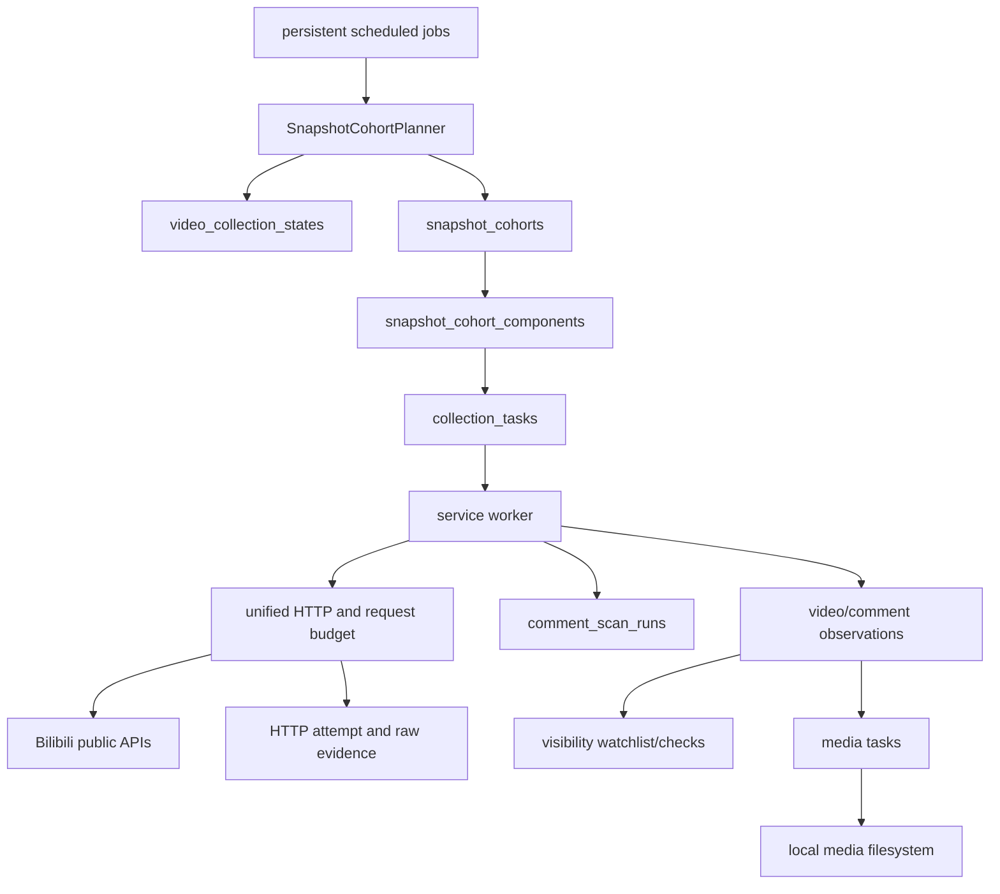

# Collection-First Snapshot Cohorts Design

Date: 2026-07-13

Status: approved in conversation; pending written-spec review

## 1. Purpose

Books of Time must preserve public Bilibili video, comment, reply, and image
state before attempting sophisticated interpretation. Collection is the
irreversible part of the system: a missed ranking, deleted comment, changed
image, or historical account field cannot be reconstructed reliably after the
fact. Analysis can be rerun against preserved evidence.

This design closes the largest current operational gap: `service run` already
discovers videos and snapshots video metrics continuously, but it does not
periodically plan hot/latest/reply collection for each monitored video.

The design introduces persistent snapshot cohorts, aggressive but bounded
comment cadence, age checkpoints, automatic latest baseline completion,
visibility evidence, and storage-first failure semantics. It deliberately
defers bot classification, player clustering, neural models, LLM analysis, and
Agent loops.

## 2. Confirmed Decisions

The following decisions are requirements, not suggestions:

1. Collection remains the center of the project. Analysis is derived and
   rebuildable.
2. Public author identifiers remain visible for manual verification.
3. Newly discovered videos from monitored official accounts are S tier for the
   first 6 hours.
4. `T+6h`, `T+12h`, `T+18h`, and `T+24h` are mandatory aligned checkpoint
   cohorts and tier reassessment points.
5. Comment collection follows video snapshots as closely as practical, but
   each API request remains an independent timestamped observation.
6. Initial activity windows use Asia/Shanghai:
   - lunch: 11:30-13:30;
   - dinner: 17:30-20:30;
   - night: 21:30-00:30.
7. Activity windows are later adjusted by a bounded, versioned, simple
   histogram policy and may auto-activate weekly.
8. S cadence ceilings are 2 minutes inside an activity window and 10 minutes
   outside; A ceilings are 10 and 30 minutes. The publish-age policy may still
   require a shorter interval.
9. Routine hot snapshots collect multiple pages: S=3, A=2, B=1, C=1.
10. Checkpoint hot targets are S=20, A=10, B=3, C=1 and are time-sliced.
11. Latest baseline must automatically progress tail scan -> head sweep ->
    complete frontier without operator intervention.
12. Later checkpoint reconciliation is size-aware: full within 100 pages;
    otherwise frontier + watchlist + deterministic stratified samples.
13. Deletion monitoring uses evidence states, not an unsupported Boolean claim.
14. Raw storage unavailability blocks new platform requests.
15. Rollout is shadow planning -> one game for 2 hours -> all games for 24
    hours.
16. Future analysis will use three independent axes:
    `automation_score`, `coordination_score`, and
    `narrative_steering_score`. None influences the base sampling schedule.
17. Routine comment monitoring is not perpetual for every historical video.
    Low-activity videos become dormant after 7 days and archived after 30 days
    unless an event, pin, or renewed growth keeps them active.
18. A checkpoint record is never silently dropped, but a request more than 60
    minutes late is a recovery observation, not a valid historical checkpoint.

## 3. Scope

### 3.1 In Scope

- Persistent per-video collection state.
- Persistent snapshot cohorts and component-level status.
- Recurring 24/7 comment planning.
- S/A/B/C tier reassessment and hysteresis.
- Active/dormant/archived video lifecycle and reactivation.
- Publish-age checkpoints at 6/12/18/24 hours.
- Routine and deep hot-comment scans.
- Automatic latest baseline and incremental continuation.
- Size-aware checkpoint reconciliation.
- Important reply refresh and visibility checks.
- Deterministic ordinary-comment sampling.
- Structured platform comment timestamps and stable public member fields.
- Persistent game/source attribution for discovered videos.
- Raw evidence for successful and failed HTTP responses where a body exists.
- Request-attempt evidence when no response body exists.
- Capacity forecasting, explicit missed slots, fairness, and alerts.
- Integrity audits and staged live acceptance.

### 3.2 Out of Scope

- Bot or human binary classification.
- Player-group labels or persistent identity labels.
- Learned embeddings or vector databases.
- Neural classifiers, LLM analysis, and Agent loops.
- Automatic platform searches by keyword or game name.
- Proxy pools, Cookie pools, CAPTCHA bypass, or rate-limit evasion.
- Bulk profile crawling for every comment author.
- Treating any sampled result as complete platform coverage.

## 4. Collection Invariants

These invariants take priority over throughput:

1. A required component is never `complete` without durable raw evidence when
   the platform returned a response body.
2. `scheduled_for`, request start, response finish, page capture, and parsed
   observation times are distinct fields.
3. A late request keeps its original schedule time and records skew. It is not
   rewritten as an on-time snapshot.
4. Mandatory checkpoints may run late. Routine expired slots are recorded as
   missed and are not executed later as fake historical snapshots.
5. One BVID has at most one active latest scan.
6. A cursor loop, retry exhaustion, or missing baseline anchor is corrupted,
   never complete.
7. Absence from a hot page does not prove deletion.
8. Missing data, failed requests, and service downtime remain visible in
   coverage and schedule-gap records.
9. Media source registration is synchronous with comment normalization; media
   binary download remains asynchronous and local-filesystem only.
10. Model outputs never alter the base cohort cadence.
11. A baseline tail scan contains historical pages and cannot satisfy a
    current-time cohort latest component.
12. Publish-age scheduling uses an immutable first-accepted platform pubdate
    anchor. Later metadata corrections do not silently move historical slots.

## 5. Runtime Architecture



New scheduled jobs:

| Job kind | Default cadence | Responsibility |
| --- | ---: | --- |
| `snapshot_cohort_planning` | 30 seconds | Plan due cohorts and recover checkpoints |
| `activity_window_policy_refresh` | weekly | Build and activate bounded activity windows |
| `evidence_integrity_audit` | daily | Stratified raw/media/reference audit |

Existing task kinds remain responsible for platform access. Hot/latest payloads
gain scan/cohort metadata. One new task kind,
`verify_comment_visibility`, uses the existing `bilibili:comment_reply` request
budget. For a root RPID it requests reply page 1 and verifies `data.root.rpid`;
this response shape was confirmed against the real public API on 2026-07-13.
For a child reply it scans bounded pages under the known root. Exhausting the
bound is `unknown_due_to_incomplete_scan`, not proof of deletion.

## 6. Persistent Data Model

Names below are logical contracts. Exact SQL types and indexes belong in the
implementation plan and Alembic review.

### 6.1 `collection_policy_versions`

Stores immutable scheduling policy versions.

```text
id / version
policy_kind
scope_type / scope_id
timezone
policy JSON
training_window_start / training_window_end
distinct_comment_count
complete_day_count
valid_exposure_minutes
excluded_comment_count / exclusion_reasons JSON
algorithm
created_at / activated_at / superseded_at
active
```

Only one active version exists per `(policy_kind, scope_type, scope_id)`.
`scope_type` is `global` or `game`; global scope uses a fixed sentinel scope ID.
Cohorts retain the version they used. Rollback activates a prior immutable
version; it does not edit history. Training/exclusion counts are scoped values,
not ambiguous project-wide totals.

### 6.2 `video_collection_states`

One row per known BVID:

```text
bvid
desired_tier / effective_tier
candidate_downgrade_tier
consecutive_downgrade_count
pinned_tier
life_stage
schedule_anchor_at
next_due_at
last_planned_at
last_completed_cohort_at
last_checkpoint_hours
policy_version
extra
created_at / updated_at
```

`life_stage` is `active`, `dormant`, or `archived`. `schedule_anchor_at` is the
first accepted Bilibili pubdate and is immutable unless an operator performs an
explicit audited rebase. Upgrades take effect immediately. Downgrades require
two consecutive assessments. A non-NULL `pinned_tier` is set by an operator,
bypasses automatic downgrade, and remains subject to request budgets. Capacity
does not rewrite `desired_tier`; execution delay is a separate fact.

### 6.3 `snapshot_cohorts`

One planned time point for one video:

```text
id
cohort_key UNIQUE
bvid
scheduled_for
reason
age_checkpoint_hours NULLABLE
desired_tier / effective_tier
policy_version
deadline NULLABLE
status
status_reason NULLABLE
started_at / finished_at
expected_component_count
completed_component_count
extra
created_at / updated_at
```

Statuses:

```text
planned
shadow_planned
running
complete
partial
missed
corrupted
blocked
not_applicable
```

`complete` means every required component completed according to its own
coverage contract. It never means the Bilibili comment set was globally
transactionally frozen or fully covered.

`blocked` means every currently required component is prevented from starting
by the DB/raw storage circuit breaker. It returns to `planned` when the health
gate recovers before the deadline. If the deadline expires first, recovery
converts the components to `missed_due_to_service_gap` and applies the routine
or checkpoint recovery policy. Mixed blocked and completed components make the
cohort `partial`, not `blocked`.

`shadow_planned` is terminal planning evidence for shadow rollout. It cannot
own executable tasks and is excluded from live miss ratios.

Status aggregation is deterministic:

- `corrupted` wins when any required component has an integrity/cursor
  corruption;
- `running` applies while any required component is running or joined to an
  active scan and no corruption exists;
- `blocked` applies only when no required component started and every
  applicable component is blocked by a health gate;
- `missed` applies when no required component started before its deadline;
- `partial` applies to every other terminal mix containing an incomplete
  required component;
- `complete` requires every applicable required component to be complete and
  every remaining required component to be `not_applicable`;
- `not_applicable` is reserved for a cohort whose entire slot predates first
  discovery or policy adoption.

`status_reason` carries facts such as `missed_due_to_service_gap`,
`missed_due_to_capacity`, `not_applicable_before_discovery`, and
`not_applicable_pre_policy`; these are not ad hoc status values.

### 6.4 `snapshot_cohort_components`

One aggregate component per cohort and kind:

```text
id
cohort_id
component_kind
required
status
scheduled_for
deadline
started_at / finished_at
skew_seconds
planned_pages / requested_pages / succeeded_pages
items_observed / raw_payloads_saved
comment_scan_run_id NULLABLE
failure_reason
extra
UNIQUE(cohort_id, component_kind)
```

Statuses:

```text
pending
running
complete
partial
joined_active_task
missed_due_to_capacity
missed_due_to_service_gap
failed
corrupted
not_applicable
blocked
```

`collection_tasks` gains nullable `snapshot_cohort_id`,
`snapshot_cohort_component_id`, `comment_scan_run_id`, `scan_slice_no`, and
`scan_slice_key`. `scan_slice_key=(scan_run_id, phase, slice_no)` is nullable
but unique across every task status, unlike the existing active-only
idempotency key. Cursor/page progress and insertion of the next numbered slice
occur in one transaction, so a running follow-up cannot accidentally reuse
itself and terminate a multi-slice scan. A component may own multiple follow-up
tasks; therefore task IDs are not stored as a single field on the component.

`planned_pages` is the planner target, `requested_pages` is the number for
which an HTTP attempt began, and `succeeded_pages` is the number with durable
raw and successful parsing. `joined_active_task` is non-terminal. When the
linked scan closes, the component becomes complete or partial based on scan
outcome and page capture times.

`failed` may still have raw evidence: this means the response was durably
saved but parsing/normalization failed. `failure_reason` and coverage distinguish
request failure, raw-storage failure, parse failure, and DB commit failure.

`collection_coverage_stats` also gains nullable `snapshot_cohort_id`,
`snapshot_cohort_component_id`, and `comment_scan_run_id` so coverage does not
depend on joining through mutable task payload JSON.

### 6.5 `collection_schedule_gaps`

Records expected routine slots that were never materialized or executed:

```text
id
bvid
gap_start / gap_end
expected_cohort_count
reason
service_instance_id NULLABLE
policy_version
created_at
```

On restart, mandatory checkpoints inside their lateness bound are recreated;
older checkpoints are recorded missed and represented by one current recovery
cohort. Routine missed periods are summarized as gaps instead of producing
thousands of stale one-minute tasks.
Gap reasons distinguish `service_offline`, `capacity`,
`not_applicable_before_discovery`, and `not_applicable_pre_policy`.

### 6.6 `comment_scan_runs`

Aggregates a logical scan across multiple 55-second task slices:

```text
id
scan_key UNIQUE
bvid / oid
snapshot_cohort_id NULLABLE
parent_scan_run_id NULLABLE
mode
status
outcome NULLABLE
started_at / finished_at
start_frontier_rpid / result_frontier_rpid
start_anchor_set / result_anchor_set JSON
start_cursor / result_cursor
target_pages NULLABLE
next_page_number NULLABLE
pages_requested / pages_succeeded
items_observed
slice_count
truncated
last_error_type / last_error_message
reason
policy_version
extra
```

Modes:

```text
hot_core
hot_deep
baseline_tail
baseline_head_sweep
incremental
full_reconciliation
segmented_reconciliation
reply_refresh
visibility_probe
```

Run statuses are `planned`, `running`, `paused`, `complete`, `partial`,
`failed`, and `corrupted`. Outcomes are orthogonal facts such as
`time_slice_yield`, `tail_reached`, `start_anchor_reached`, `frontier_reached`,
`frontier_missing`, `server_end`, and `retry_exhausted`. Implementations never
put an outcome string in the status column. A paused run remains active.

Raw page observations and comment observations gain nullable `scan_run_id`.
An active latest-mode partial unique constraint covers `planned`, `running`,
and `paused` runs and prevents overlapping latest scans for the same BVID.

For latest modes, `frontier_states` is the sole authoritative physical resume
state and gains `active_scan_run_id`; its cursor and per-cursor attempt fields
are updated transactionally with scan counters. `comment_scan_runs` supplies
identity, start/result evidence, and aggregate history. Opaque cursor strings
are never ordered or compared. For page-number modes such as hot deep scan,
`comment_scan_runs.next_page_number` is the authoritative resume position.

`frontier_states` also gains a monotonic `version` for compare-and-swap updates
and a JSON list of up to five ordered head anchors with RPID and
`platform_created_at`. The baseline's initial head and every later incremental
frontier use the same multi-anchor representation. The legacy `frontier_rpid`
remains the first/primary anchor for compatibility. Seeing any retained anchor
is sufficient to close a head scan; the other anchors provide deletion
resilience. An empty comment section establishes an explicit empty frontier
rather than a corrupted baseline.

### 6.7 `known_video_sources`

Persists discovery attribution that currently exists mainly in task payloads:

```text
id
bvid
source_mid
pool_type
pool_id
game_id NULLABLE
official
monitored
first_seen_at / last_seen_at
raw_page_observation_id
active
UNIQUE(bvid, source_mid, pool_type, pool_id)
```

This is many-to-many because one video may be associated with multiple source
pools or event targets. Discovery merges all source associations for a MID
instead of retaining only the first `setdefault` source. A video qualifies for
the automatic six-hour S rule when any active source row is both `official`
and `monitored`. `game_id` is the stable game slug copied from the configured
pool/event context; manual corrections create auditable associations rather
than rewriting discovery history.

### 6.8 `comment_visibility_watchlist`

Separate from the important-reply watchlist:

```text
id
bvid / oid / rpid
root_rpid / parent_rpid
priority
selection_reasons JSON
sampling_stratum NULLABLE
selection_hash NULLABLE
first_seen_at / last_seen_at
last_checked_at / next_check_at
expires_at
current_evidence_state
active
extra
UNIQUE(bvid, rpid)
```

Objective collection reasons include hot position, interaction counts, media,
report pin, operator pin, and deterministic ordinary sampling. Future model
selection is allowed only as an additional explicit reason.

### 6.9 `comment_visibility_checks`

Append-only evidence for every attempted check:

```text
id
bvid / oid / rpid
snapshot_cohort_id NULLABLE
watchlist_id NULLABLE
selection_reason
sampling_stratum / selection_hash
check_method
result
checked_at
raw_payload_id / raw_page_observation_id NULLABLE
comment_observation_id NULLABLE
failure_reason
extra
```

Checks and state transitions are separate. `comment_visibility_events` records
only transitions derived from sufficient checks.

`check_method` values are `observed_hot`, `observed_latest`, `observed_reply`,
`root_reply_probe`, `child_reply_scan`, `full_reconciliation`, and
`segmented_sample`. `high` visibility priority means watchlist priority >= 80;
the initial planner schedules at most five such direct checks per cycle before
applying normal capacity/fairness rules.

### 6.10 Comment Entity And Observation Extensions

Three timestamps are mandatory:

```text
platform_created_at  # Bilibili ctime
first_seen_at        # first collection sighting
captured_at          # this observation
```

`CommentEntity` gains nullable `platform_created_at` and first-seen public
member metadata. `CommentObservation` gains `platform_created_at` plus stable
public author fields:

```text
author_level
author_official_type / author_official_description
author_vip_status / author_vip_type
author_is_senior_member
author_public_metadata_extra JSON
```

The parser stores known stable fields as columns and the remaining safe public
member subset in an allowlisted, versioned JSON object. `platform_created_at`
is parsed from integer `ctime` as UTC. Missing/invalid `ctime` remains NULL and
sets parser evidence; a reparse fills only NULL values and never overwrites a
non-NULL timestamp. Complete response data remains in raw. The
collector does not issue bulk profile requests for comment authors. Approximate
IP location and other unnecessary personal fields remain raw-only unless a
separate reviewed requirement justifies structuring them.

### 6.11 `http_request_attempts`

Every formal HTTP attempt gets a write-ahead row, including attempts with no
response body:

```text
id
task_id / cohort_id / component_id NULLABLE
status
request_type
attempt_started_at
request_started_at NULLABLE / request_finished_at NULLABLE
response_received_at NULLABLE
duration_ms
method
url_hash / params_hash
http_status NULLABLE
error_type / error_message NULLABLE
raw_payload_id NULLABLE
created_at
```

Before network I/O, a short transaction inserts `status=started` with
`attempt_started_at`; DB/raw health failure prevents that request. The actual
`request_started_at` is captured only after token acquisition and is persisted
with the response or transport failure. A crash may therefore leave it NULL
rather than inventing a network timestamp. After the response, raw archival and
a short DB transaction move the attempt to `succeeded` or `failed`. A process
crash leaves an auditable `abandoned` attempt that recovery can close. Cookie,
CSRF, refresh token, full authenticated URL, and sensitive headers are never
stored. If a response body exists, it is archived and linked before the attempt
can support a successful component. Timeout/DNS failures have an attempt row
and no raw payload. `duration_ms` measures actual network time when both
`request_started_at` and `request_finished_at` exist, not queue or token wait.

The attempt status vocabulary is exactly `started`, `succeeded`, `failed`, and
`abandoned`.

## 7. Cohort Planning Policy

### 7.1 Time Axes

- Publish-age slots are anchored to immutable
  `video_collection_states.schedule_anchor_at`, initialized from the first
  accepted Bilibili `pubdate`, not scheduler wake-up time.
- Activity windows use Asia/Shanghai local time, including a window crossing
  midnight.
- Database timestamps remain UTC-aware.
- `scheduled_for` is immutable. `captured_at` is actual response time.

### 7.2 Effective Interval

```text
effective_interval = min(
    age_and_growth_interval,
    tier_ceiling_for_current_activity_window,
    time_until_mandatory_checkpoint,
)
```

Existing age/growth policy remains:

| Condition | Interval |
| --- | ---: |
| age < 30 minutes | 1 minute |
| 30 minutes <= age < 6 hours | 5 minutes |
| 6h+, recent hourly view growth > 30000 | 5 minutes |
| 6h+, growth > 6000 | 15 minutes |
| 6h+, growth > 1200 | 30 minutes |
| otherwise | 120 minutes |

Tier ceilings:

| Tier | Activity window | Other time |
| --- | ---: | ---: |
| S | 2 minutes | 10 minutes |
| A | 10 minutes | 30 minutes |
| B | 30 minutes | 60 minutes |
| C | 60 minutes | 120 minutes |

Consequences:

- 0-30 minutes stays at 1 minute.
- 30 minutes-6 hours is 2 minutes in an S activity window and 5 minutes
  otherwise.
- Activity windows only increase collection frequency.

### 7.3 Tier Policy

All videos discovered from monitored official game pools are S while immutable
publish age is under 6 hours. Discovery does not start a fresh six-hour S
window for an already-old video. After publish age 6 hours, any one of the
following retains or upgrades S:

- active event core video;
- operator pin;
- active `major_creator` involvement;
- configured high view or comment growth;
- configured sustained hot Top-N turnover.

OR semantics intentionally make S broad. For numeric signals, the first tier
whose configured threshold is met wins: S, then A, then B, otherwise C. The
initial defaults are:

| Tier | Hourly view growth | Hourly comment growth | Sustained hot Top-20 turnover |
| --- | ---: | ---: | ---: |
| S | >= 6000 | >= 60 | >= 0.35 |
| A | >= 1200 | >= 20 | >= 0.20 |
| B | >= 300 | >= 5 | not required |

Turnover is sustained only after two consecutive successful hot-core pairs;
missing or incomplete input never counts as meeting a threshold. Event-core,
operator-pin, and `major_creator` rules can still force S independently of the
numeric table. Upgrades are immediate. Downgrades require two consecutive
reassessments. Reassessment runs at 6/12/18/24 hours and hourly after 24 hours.

Model-derived bot, steering, stance, or coordination values are excluded from
tiering.

### 7.4 Monitoring Lifecycle

Tier is sampling intensity; lifecycle controls eligibility:

| State | Default entry | Routine behavior |
| --- | --- | --- |
| active | discovery through day 7 | normal cohort policy |
| dormant | age >= 7 days, low growth, no event/pin | one daily low-cost cohort in the nearest activity window |
| archived | age >= 30 days under the same conditions | weekly video-metric reactivation probe; no routine comments |

An active event, operator pin, or renewed view/reply growth immediately returns
a dormant/archived video to active and reassesses tier. Dormant daily cohorts
contain stats, one hot page, and latest incremental when a complete frontier
exists. Archived weekly probes contain video metrics only. The 22:00 terminal
snapshot uses this same eligibility policy: it remains additive for videos
published that day and eligible active videos, but no longer traverses every
historical `known_videos` row forever.

Lifecycle thresholds are defaults and versioned policy fields. Transitioning
to dormant/archived is not a schedule gap because no routine cohort is expected
in that state.

### 7.5 Mandatory Age Checkpoints

At T+6/12/18/24 hours, always materialize the checkpoint and all applicable
required components. A routine slot in the same 30-second planner bucket is
coalesced into the richer checkpoint instead of issuing duplicate requests;
the checkpoint records the coalesced routine slot in `extra`. Nearby routine
slots outside that bucket remain independent. Stable keys use BVID plus
publish-age checkpoint.

Checkpoint records never disappear. The component start deadline is
`scheduled_for + 60 minutes`, inclusive, and `skew_seconds` is the first HTTP
attempt start minus `scheduled_for`. A component that has not started by that
deadline is not sent as stale work. It becomes `missed_due_to_service_gap` or
`missed_due_to_capacity`; a deep scan whose first request began on time may
finish later, with every page retaining its own capture time.

If no required component started by the deadline, the checkpoint cohort is
`missed`; if only some components started, it is `partial`. Reasons distinguish
`missed_due_to_service_gap` and `missed_due_to_capacity`. One immediate
current-time recovery cohort contains the union of required component kinds
that lack usable evidence across all checkpoints overdue at that moment. It
does not repeat component kinds already captured successfully, and current data
is never duplicated and mislabeled as several historical ages. A video first
discovered after a checkpoint records a `not_applicable` cohort with reason
`not_applicable_before_discovery`; its adoption cohort captures current state
instead. A checkpoint can still be corrupted; mandatory means represented and
audited, not guaranteed successful.

### 7.6 Routine Deadlines

A routine cohort deadline is the next planned routine slot and applies to task
start, not task completion. If a required component has not started by then,
it becomes `missed_due_to_capacity`; an already started component may finish
after the deadline and records final skew. The planner does not send a stale
request later. The missed component and any wider service gap remain queryable.

### 7.7 Idempotency And Planner Transactions

Stable keys are:

```text
routine cohort:     snapshot:{bvid}:{scheduled_for}:routine
checkpoint cohort:  snapshot:{bvid}:age:{hours}h
recovery cohort:    snapshot:{bvid}:recovery:through:{latest_overdue_hours}h
component:          {cohort_key}:{component_kind}
scan slice:         {scan_run_id}:{phase}:{slice_no}
```

`scheduled_for` in a key is canonical UTC with whole-second precision. Policy
version is evidence, not part of a time-slot key. The recovery key is stable
across planner retries and advances only when a later checkpoint becomes
overdue; repeated planning upserts the deterministic union of still-missing
component kinds into that same recovery cohort. Under a PostgreSQL row lock,
the planner creates cohort, expected components, and first tasks in one
transaction. Unique constraints, not preflight SELECT alone, resolve competing
schedulers. Slice progress and next-slice insertion are likewise atomic.

## 8. Component Policies

Component kinds are explicit. Active routine core is `video_metrics`,
`hot_core`, and `latest_current_head`. Checkpoint core replaces the latest
component with `latest_reconciliation`; configured `hot_deep`, due
`important_replies`, `visibility_watchlist`, and `ordinary_visibility_sample`
are also required checkpoint components but are reported separately from core
miss ratios. Dormant core is metrics, one hot page, and latest incremental only
when a complete frontier exists. Archived core is the metric reactivation probe
alone. Media download is ancillary and never gates cohort completion.

`required` means policy expected the component; it does not imply the request
can bypass capacity. A required component may end as an explicit miss, making
the cohort partial or missed under the aggregation rules above.

### 8.1 Video Metrics

Every cohort includes the existing combined video stats/info/availability
request. Platform-declared unavailable videos retain availability/raw evidence
and stop future normal cohorts unless explicitly reactivated.

The cohort planner becomes the only owner of routine/checkpoint video-metric
scheduling for adopted known videos. The existing `video_snapshot_sweep`
delegates to the planner during migration and is then retired; the video stats
collector stops recursively scheduling its next snapshot. The independent
daily terminal job creates an additive cohort through the same planner. Manual
one-shot metric tasks remain supported.

### 8.2 Hot Comments

Routine targets:

| Tier | Pages |
| --- | ---: |
| S | 3 |
| A | 2 |
| B | 1 |
| C | 1 |

Checkpoint/initial deep targets:

| Tier | Pages |
| --- | ---: |
| S | 20 |
| A | 10 |
| B | 3 |
| C | 1 |

The first routine pages form `hot_core`. At a checkpoint they count toward the
total target: S core collects pages 1-3 and deep continues at page 4 through
20; A deep continues at page 3 through 10; B continues at page 2 through 3;
C has no deep remainder. Deep scans use at most 10 pages and 55 seconds per
numbered task slice, then atomically enqueue the next unique slice. Server end
stops the scan early.

Every page has its own capture time. A 20-page deep scan is never represented
as a platform transaction snapshot. RPID deduplicates entities; repeated page
appearances remain append-only observations.

### 8.3 Latest Comments

One BVID has one active latest scan. A task slice runs for at most 55 seconds,
but high-frequency cohorts shorten the slice to preserve a single-worker yield
point:

```text
slice_seconds = min(55, max(10, floor(effective_interval_seconds * 0.4)))
```

This yields 24 seconds for a one-minute slot and 48 seconds for a two-minute
slot. The same cursor receives at most three attempts with the configured
1/3/5 second retry delays, persisted across numbered follow-ups. Long tasks
renew their lease; stale workers cannot commit after scan-version CAS fails.

Baseline acquisition uses two linked, immutable-mode scan runs:

```text
baseline_tail
  -> paused + automatic follow-up
  -> complete(tail_reached) + atomic child baseline_head_sweep run/task
  -> corrupted

baseline_head_sweep
  -> paused + automatic follow-up
  -> any initial start anchor reached -> complete/frontier established
  -> corrupted
```

After completion:

```text
incremental head scan
  -> old frontier reached -> complete/new frontier
  -> paused + follow-up
  -> tail reached without frontier -> frontier_missing
  -> corrupted
```

If a cohort arrives while a compatible latest scan is active, its latest
component links the active scan as `joined_active_task`. Only a head-sweep or
incremental scan can provide current-head evidence. A tail scan is historical;
the component remains `joined_active_task` while the automatic head sweep can
still satisfy its deadline rather than treating tail pages as current. It
becomes complete only if a successful head page was captured in
`[scheduled_for, deadline)` and raw/parse requirements passed. At deadline it
otherwise finalizes `partial` with reason `baseline_tail_in_progress` or
`current_head_not_captured`. No path creates an overlapping baseline or
incremental scan.

The first baseline head page records up to five ordered initial anchors. In the
transaction that marks the tail run complete, the collector creates a linked
`baseline_head_sweep` run, moves `frontier_states.active_scan_run_id` to it, and
inserts its first slice with key `(child_scan_run_id, head_sweep, 0)`. The
30-second planner repairs a missing child run/task from the tail run's stable
key; uniqueness makes the repair idempotent. Each later incremental frontier
also stores up to five ordered head anchors. Matching any applicable anchor
closes the scan. If every anchor is absent, the scan continues under
reconciliation semantics rather than treating one deleted RPID as definitive
corruption. Empty sections use an explicit empty frontier.

Raw saved but parse/normalization failed produces component `failed` with raw
evidence and parser error details. It is not `complete`; the preserved raw can
be reparsed after a parser fix.

### 8.4 Important Replies

The existing important-reply watchlist remains signal-driven. Routine root
budgets are S=3, A=2, B=1, C=0 per cohort. Checkpoint caps reuse the existing
tier budgets S=30, A=10, B=2, C=0. A cohort refreshes only due roots and records
omitted roots as capacity or applicability outcomes. Reply deep-tree
completeness is not claimed.

### 8.5 Media

Comment parsing synchronously registers ordered media sources and relation
rows. Download tasks use the unified request budget and local SHA-256 storage.
Media download is ancillary to cohort timing and does not rewrite comment
capture time. Storage failure keeps media tasks pending and does not discard
source references.

## 9. Activity Window Adaptation

Initial windows:

```text
lunch  11:30-13:30
dinner 17:30-20:30
night  21:30-00:30
```

The v1 learner is deliberately simple:

1. Use the latest 28 days.
2. Count distinct RPID by `platform_created_at`, not observation count.
3. Exclude historical stock ingested during baseline. Learn only from comments
   created after baseline completion and captured by valid incremental scans
   within the configured discovery-delay bound.
4. Normalize counts by valid monitored-video exposure minutes. Service gaps and
   incomplete windows have no exposure and are never interpreted as zero
   activity.
5. Split by game and weekday/weekend.
6. Bucket into 30-minute Asia/Shanghai slots.
7. Take the median exposure-normalized rate across comparable weeks.
8. Smooth with a three-bucket moving average.
9. Select the densest contiguous window within guardrails.
10. Move any boundary by at most 30 minutes per weekly version and at most 60
    minutes from its initial boundary across all versions.

Guardrails:

| Window | Candidate range | Minimum duration |
| --- | --- | ---: |
| lunch | 10:30-14:30 | 2 hours |
| dinner | 16:30-21:00 | 3 hours |
| night | 20:30-01:30 | 3 hours |

Game-specific activation requires at least 14 complete collection days and
2000 distinct comments in the 28-day training window. Otherwise use the global
active version, then fixed defaults if global evidence is also insufficient.

Policy evidence reports included/excluded comments, valid exposure minutes,
service-gap minutes, and exclusion reasons per game. This makes the survivorship
and coverage boundary visible instead of silently favoring easy-to-baseline
videos.

Adapted windows may overlap within guardrails. Overlap means one active Boolean
window, not two stacked boosts; the shortest tier ceiling is applied once.

The weekly bounded candidate auto-activates after validation. Invalid,
out-of-range, or insufficient-data candidates do not activate. Prior versions
remain rollback targets.

## 10. Visibility And Reconciliation

### 10.1 Evidence States

```text
visible
folded
suspected_missing
confirmed_missing_after_reconciliation
platform_explicit_unavailable
reappeared
unknown_due_to_incomplete_scan
```

The existing `is_deleted` Boolean is not authoritative. A current-state view
may be derived from append-only checks/events, but historical content is never
overwritten or removed.

### 10.2 Two-Stage Confirmation

1. A meaningful expected surface fails to show a watchlisted comment, or a
   targeted check cannot find it: create a suspected result.
2. A later independent successful check confirms unavailable, still missing,
   visible, or reappeared.

Dropping from a hot page alone is ranking movement and never starts deletion
confirmation.

The installed Bilibili wrapper does not expose a generic
`Comment.get_info(rpid)`. A real unified-client request on 2026-07-13 confirmed
that `Comment.get_sub_comments(page=1)` returns `data.root` with the requested
root RPID, so `root_reply_probe` is a supported root check. Child replies use a
bounded scan under that root. Failing to find a child before the bound remains
unknown unless reconciliation supplies independent evidence.

`platform_explicit_unavailable` may be confirmed immediately when the platform
returns a documented target-specific unavailable result. Otherwise one
completed reconciliation missing a comment is only suspected. Confirmation
requires two successful, independent scan/check IDs separated by at least one
planned check interval, both without request errors or cursor drift. Root and
child comments are confirmed independently.

A new high-priority `suspected_missing` result schedules its next independent
check for 10 minutes later and has a 30-minute service-level target. By the
target it must have either a completed independent check or an explicit
capacity/service/storage gap; silent overdue checks are not allowed. Lower
priority ordinary samples are rechecked at their next checkpoint or configured
watchlist slot. These bounds apply only to watchlisted comments and do not turn
sampled coverage into a claim that every platform comment is monitored.

### 10.3 Checkpoint Reconciliation

At every 6/12/18/24-hour checkpoint, a known prior baseline larger than 100
pages goes directly to segmented reconciliation. Otherwise the collector starts
a bounded full-reconciliation candidate. It earns full coverage only if it
reaches the tail within both 100 pages and 900 logical seconds; crossing either
bound transitions to segmented reconciliation. Segmented coverage includes the
current frontier region, visibility watchlist, hot core/deep pages, and
deterministic stratified root samples.

The first baseline is not capped at 100 pages. It continues in slices until
tail or corruption. The page and wall thresholds control repeated checkpoint
reconciliation only. A run that switches to segmented coverage cannot produce
a full-reconciliation confirmation event.

Sampling uses a stable hash of policy version, BVID, RPID, stratum, and
checkpoint. The watchlist stores that derived `selection_hash`, not an
independently mutable seed. Checks store the derivation inputs, stratum,
population information, and reason.
Targeted/model-selected rows are reported separately from ordinary samples.

## 11. Capacity, Fairness, And Backlog

Before materializing a planning horizon, estimate request demand against the
configured global, host, and request-type token capacities. The token bucket
remains the final authority; forecasting avoids knowingly creating impossible
routine work.

Priority order:

```text
mandatory checkpoint core
due S core components
latest baseline/head-sweep continuation with one-slice quantum
A core components
mandatory checkpoint auxiliary components
high-priority visibility checks
B/C routine components
hot deep follow-up pages
due important-reply refreshes
ordinary visibility samples
media downloads
```

The planner uses deterministic deficit round-robin between games within the
same class before materializing tasks. Worker leasing applies a capped waiting
age bonus after base priority; it does not rely on strict static priority alone.
Baseline continuation inserts one numbered slice at a time and yields after
that slice, preventing a deep baseline from monopolizing a single worker.
Reply, visibility, and media work receives the capped waiting-age bonus, but
ancillary work never outranks mandatory checkpoint core. Media also keeps its
own request-type bucket, so it cannot consume comment-type tokens even though
all work still shares global and host budgets. These rules prevent permanent
media/reply/visibility starvation and one high-output account monopolizing
capacity.

Capacity decisions never rewrite tier. Every omitted expected component stores
estimated cost, available capacity, and decision reason. Routine stale work is
missed rather than accumulated.

The default rate limits impose a concrete envelope. `comment_hot=0.2 rps`
allows 12 pages/minute. One activity-window S video needs 3 pages every 2
minutes, so eight simultaneous S videos saturate that request-type budget
before deep scans. The minimum core load for 20 S videos is
`20 * (1 stats + 3 hot + 1 latest) / 120 = 0.833 rps`, already above the
default `host:bilibili=0.8 rps` before replies, media, retries, or deep pages.
Therefore S is a desired evidence tier, not a promise that an arbitrary number
of S videos can all be on time. Capacity planning must emit explicit misses or
reduced optional work and never exceed token buckets.

Operational alerts include:

- any missed S routine component;
- checkpoint skew over threshold;
- baseline age over threshold;
- projected 15-minute capacity utilization over 80%;
- oldest media/visibility pending age over threshold;
- repeated per-game fairness loss;
- corrupted scan or failed integrity audit.

## 12. HTTP, Raw Evidence, And Storage Failure

Required order:

```text
platform response
  -> durable raw object and SHA-256
  -> raw_payloads index
  -> parse/normalize
  -> observations and coverage
  -> task/component completion
```

Worker execution does not keep the lease-selection transaction or row lock
open across network waits. Each page follows five explicit boundaries:

1. short transaction: lease task, record owner/version, commit;
2. short transaction: insert write-ahead HTTP attempt, commit;
3. no DB transaction: acquire tokens and perform network I/O;
4. durable object write, then short transaction: raw index, raw page,
   observations, scan counters, and frontier/version CAS;
5. short final transaction: coverage, component, scan, and task status plus
   insertion of the next numbered slice when needed.

Page progress commits independently, so a crash does not discard an entire
55-second slice. Tasks renew leases before one third of the 120-second lease
remains. A worker whose lease or scan CAS version is stale cannot commit page
progress or create a follow-up.

The service checks DB and raw-storage writability before issuing formal
collection requests. If raw storage is unavailable, tasks remain waiting and
components become blocked; the service does not intentionally collect
structured-only evidence.

If storage fails after a response was already received, the request attempt is
failed and the component cannot complete. An orphan raw object after a DB
rollback is acceptable and auditable; a successful DB claim pointing to a
missing raw object is not.

403/429/captcha/5xx bodies are archived when available before classified
failure propagation. This responsibility belongs to an evidence-aware HTTP
middleware before `RequestFailure` is raised, not to individual collectors.
Filesystem raw writes use a temporary object, flush/fsync where supported, and
atomic rename before the DB index transaction. Timeout/DNS failures record an
attempt without a body. After a DB error, failure recording uses a rolled-back
fresh transaction. Secrets and authenticated values remain excluded.

Media storage unavailability blocks media requests but does not block comment
requests or source registration. Cookie invalidity degrades to anonymous
requests and remains independent from service lifecycle.

## 13. Restart And Recovery

On service restart:

1. Recover expired task leases.
2. Resume unfinished scan runs from durable cursor/page progress.
3. Recreate a missing mandatory checkpoint only inside its 60-minute lateness
   bound; otherwise record it missed and create one current recovery cohort.
4. Do not execute stale routine cohorts.
5. Summarize service-offline routine slots in `collection_schedule_gaps`.
6. Resume the active policy version and per-video tier state.

All recovery paths are idempotent under multiple scheduler instances and use
PostgreSQL locks/constraints. SQLite remains a single-process development
target.

## 14. Evidence Integrity Audits

Daily stratified audit samples by date, request type, and storage backend:

- URI existence;
- zstd decompression;
- uncompressed size and payload SHA-256;
- observation -> raw page -> raw payload resolution;
- media URI -> `blob_sha256` verification;
- cohort component -> task/scan/coverage resolution.

Operator full audits cover all raw/media objects, dangling logical references,
and orphan filesystem objects. Audit failure raises an operational alert and
records affected evidence. It never auto-deletes or overwrites evidence.

## 15. Analysis Boundary

Collection stores facts. Derived account/game vectors and model scores are
rebuildable artifacts.

Future interpretable account-game features use, per account/game/window:

```text
stance_score
participation_score
confidence
evidence_count
model_version
```

The effective clustering coordinate is initially `stance_score * confidence`,
with participation and missingness retained separately. Automation,
coordination, and narrative-steering scores remain independent axes.

Near-term analysis should prefer SQL, exact normalized hashes, simple text
similarity, timing statistics, versioned lexicons, manual review, and basic
PCA/HDBSCAN exploration. Neural models wait for adequate data and labels.

Future LLM/Agent analysis is read-only by default. It consumes frozen evidence
bundles and records model, prompt version, tool calls, evidence IDs, claims, and
uncertainty. It cannot mutate raw/observations or bypass the scheduler. A
request for more data becomes an audited collection request subject to normal
budgets.

## 16. Configuration Shape

The implementation and operator documentation use this configuration contract:

```yaml
discovery:
  game_uid_pools:
    genshin_impact:
      game_id: genshin_impact
      official: true
      monitored: true
      uids: [401742377]

snapshot_cohorts:
  enabled: true
  planning_seconds: 30
  timezone: Asia/Shanghai
  routine_deadline_mode: next_slot
  checkpoint_hours: [6, 12, 18, 24]
  checkpoint_max_lateness_minutes: 60
  downgrade_confirmations: 2
  tier_policy:
    official_s_age_hours: 6
    reassess_after_24h_minutes: 60
    hot_turnover_confirmations: 2
    s: {view_growth_per_hour: 6000, comment_growth_per_hour: 60, hot_top20_turnover_ratio: 0.35}
    a: {view_growth_per_hour: 1200, comment_growth_per_hour: 20, hot_top20_turnover_ratio: 0.20}
    b: {view_growth_per_hour: 300, comment_growth_per_hour: 5}
  lifecycle:
    dormant_after_days: 7
    archive_after_days: 30
    dormant_interval_minutes: 1440
    archived_metric_probe_minutes: 10080
  capacity_horizon_minutes: 15
  capacity_utilization_alert_ratio: 0.8
  activity_windows:
    defaults:
      - {name: lunch, start: "11:30", end: "13:30"}
      - {name: dinner, start: "17:30", end: "20:30"}
      - {name: night, start: "21:30", end: "00:30"}
    auto_refresh: true
    refresh_days: 7
    training_days: 28
    min_complete_days: 14
    min_distinct_comments: 2000
    max_comment_capture_delay_minutes: 10
    max_boundary_shift_minutes: 30
    max_boundary_offset_minutes: 60
  tier_intervals_minutes:
    s: {active: 2, normal: 10}
    a: {active: 10, normal: 30}
    b: {active: 30, normal: 60}
    c: {active: 60, normal: 120}
  hot_pages:
    routine: {s: 3, a: 2, b: 1, c: 1}
    checkpoint: {s: 20, a: 10, b: 3, c: 1}
    max_pages_per_slice: 10
  scan_slice_seconds: 55
  high_frequency_slice_fraction: 0.4
  min_scan_slice_seconds: 10
  reply_roots:
    routine: {s: 3, a: 2, b: 1, c: 0}
    checkpoint: {s: 30, a: 10, b: 2, c: 0}
  visibility:
    high_priority_min: 80
    max_high_priority_checks_per_cycle: 5
    suspected_recheck_minutes: 10
    high_priority_resolution_target_minutes: 30

comment_reconciliation:
  full_scan_max_pages: 100
  full_scan_max_wall_seconds: 900
  deterministic_sample_enabled: true

evidence_integrity:
  enabled: true
  evaluation_seconds: 86400

collection_acceptance:
  raw_resolution_ratio: 1.0
  max_unexplained_failed_tasks: 0
  max_corrupted_scans: 0
  s_core_max_miss_ratio: 0.01
  a_core_max_miss_ratio: 0.05
  feasible_load_max_utilization_ratio: 0.8
  checkpoint_max_skew_seconds: 3600
  capacity_forecast_max_error_ratio: 0.15
  high_priority_game_max_starvation_seconds: 600
  high_priority_visibility_max_silent_overdue: 0
```

Configuration validation rejects invalid tiers, non-positive intervals,
scan slices >= scheduler/task lease, contradictory lifecycle thresholds, and
checkpoint lists other than strictly increasing positive hours. Tier thresholds
must be monotonic from S through B, ratios stay in `[0, 1]`, and the visibility
resolution target cannot be shorter than its recheck interval. Activity windows
may overlap; evaluation treats their union as one active state and never stacks
boosts.

## 17. Migration And Compatibility

- All schema changes use reviewed Alembic revisions with upgrade/downgrade.
- Existing observations remain valid with nullable new fields.
- Reparse from raw may backfill `platform_created_at` and author metadata; it
  never overwrites original content or raw references.
- Existing completed tasks remain legacy standalone history. Pending manual hot
  tasks may continue without cohort IDs; pending latest tasks are mapped to
  synthetic scan runs before planner activation so they cannot race a new
  frontier owner.
- The planner adopts known videos incrementally and does not create stale
  historical routine cohorts.
- Existing `frontier_states` remains the mutable latest resume state;
  `comment_scan_runs` is mutable only while active and becomes immutable
  logical-run history after a terminal status.
- Docker, Linux systemd, and Windows native operation use the same service
  kernel. Docker still connects to external PostgreSQL. Media remains local.

Planner activation is a controlled migration boundary:

1. stop scheduler/worker processes and recover expired leases;
2. apply schema migration with planner disabled;
3. map every pending/backoff legacy latest task to a synthetic scan run, or
   drain it before proceeding;
4. reject activation while any unmapped running/latest task exists;
5. initialize `frontier_states.active_scan_run_id` and version under row lock;
6. disable the legacy `video_snapshot_sweep` job and collector recursive
   scheduling paths while leaving the daily terminal handler delegated to the
   planner;
7. verify no legacy routine owner is enabled, then enable the cohort planner as
   the sole routine/checkpoint scheduler.

This prevents a legacy task and a new scan from concurrently updating the same
frontier. The owner switch occurs in one maintenance window with the planner
disabled until verification passes; it is not described as an atomic database
transaction across code/config deployment.

## 18. Verification Strategy

### 18.1 Deterministic Clock Tests

Simulate 48 hours in seconds and cover:

- T+0/30m/6h/12h/18h/24h;
- activity and non-activity cadence;
- midnight-crossing night window;
- immediate upgrade and two-step downgrade;
- checkpoint/routine collision;
- policy version rollover;
- service outage and restart gap reconstruction.

Every planner, policy learner, capacity forecaster, and checkpoint calculator
accepts a `Clock` protocol exposing `utc_now()` and timezone conversion.
Production delegates to the system clock; tests inject a controllable clock.

### 18.2 PostgreSQL Integration

- Multi-scheduler cohort idempotency.
- Multi-worker `SKIP LOCKED` leasing.
- Distributed request-budget limits.
- Scan active uniqueness and cursor resume.
- Tail -> linked head-run automatic baseline completion and multi-anchor
  resilience.
- Hot deep slicing and follow-up.
- Checkpoint late recovery-key idempotency and routine expiry.
- Deterministic visibility sampling.
- High-priority visibility follow-up deadline or explicit gap.
- Game-source persistence.
- Alembic upgrade/downgrade/check.

### 18.3 Failure Injection

- Read-only/unavailable raw storage.
- Unavailable media storage.
- DB transaction failure after object write.
- Truncated/corrupt zstd and hash mismatch.
- 403/429/5xx/captcha body archival.
- Timeout/DNS request-attempt evidence.
- Disk-space safety threshold.

### 18.4 Load Simulation

At least 20 simultaneous S videos spanning all configured games. Verify
capacity forecast, checkpoint protection, deterministic missing outcomes,
game fairness, bounded aging, and no permanent task-kind starvation. This is
an overload test, not a promise that all 20 S videos meet two-minute cadence
under default limits. It must prove token limits are never exceeded and every
unscheduled component has an auditable capacity outcome. S/A miss-ratio service
levels are not evaluated against this deliberately infeasible fixture.

### 18.5 Staged Live Rollout

1. Shadow planning: create immutable `shadow_planned` cohorts/forecasts without
   creating executable collection tasks.
2. One game for 2 hours.
3. All configured games for 24 hours, including an activity window and
   midnight crossing.
4. Formal enablement after acceptance report review.

The 24-hour report includes planned/complete/partial/missed cohorts,
checkpoint skew, requests/pages by kind, baseline states, raw integrity,
capacity saturation, per-game fairness, media backlog, visibility checks, and
every failure with explanation.

## 19. Acceptance Criteria

The phase is complete only when:

1. Recurring hot/latest comment cohorts are automatically planned 24/7 for
   eligible known videos.
2. S/A/B/C, activity windows, and age/growth policy produce deterministic
   documented slots.
3. T+6/12/18/24 checkpoints are idempotent, recoverable, component-audited,
   and never generate more than one recovery cohort for the same overdue set.
4. Routine hot and checkpoint deep-page targets are enforced without claiming
   transactional multi-page snapshots.
5. Latest baseline automatically reaches complete tail + head state or clearly
   records corruption.
6. Large checkpoint reconciliation switches at the configured page bound and
   reports sampling coverage.
7. Visibility checks distinguish suspected, confirmed, unavailable, unknown,
   and reappeared evidence; every due high-priority suspicion has an independent
   follow-up or explicit gap by its 30-minute target.
8. Comment `ctime`, stable public author metadata, and video game/source
   attribution are queryable and raw-backed.
9. A response-backed successful component always resolves to verified raw.
10. Raw-storage outage prevents new platform requests.
11. Restart recovery creates checkpoints and schedule gaps without stale
    routine requests, and planner activation leaves exactly one routine video
    scheduling owner.
12. All acceptance runs require raw resolution=100%, unexplained failed tasks=0,
    corrupted scans=0, capacity forecast error <=15%, and silent overdue
    high-priority visibility checks=0. During service-healthy staged-live
    windows whose projected utilization is <=80%, S core miss ratio is <=1%, A
    core miss ratio is <=5%, checkpoint start skew is <=3600 seconds, and no
    high-priority game waits more than 600 seconds solely because another game
    consumed its share. Miss ratios use expected required core components as
    the denominator and exclude `not_applicable` cohorts/components. The
    deliberately overloaded 20-S simulation instead requires zero token-budget
    violations, bounded fair scheduling, and an explicit capacity outcome for
    every omission; it is not judged by feasible-load miss ratios. Explicit
    capacity/service/storage gaps remain failures to inspect, not hidden
    successes.
13. All tests, Ruff, Alembic check, migration cycle, documentation, and real
    smoke evidence pass.

## 20. Implementation Order

The implementation plan should split this design into independently
acceptable phases:

1. Evidence schema and irreversible comment/source fields.
2. Cohort/state schema and pure scheduling policy.
3. Cohort planner with shadow mode and component tasks.
4. Hot core/deep scan runs and slicing.
5. Latest scan runs and automatic baseline head sweep.
6. Visibility watchlist, checks, and size-aware reconciliation.
7. Capacity gaps, fairness, alerts, and storage circuit breaker.
8. Activity-window policy refresh and rollback.
9. Integrity audit, documentation, and staged live acceptance.

Analysis model implementation remains a separate future design cycle.
